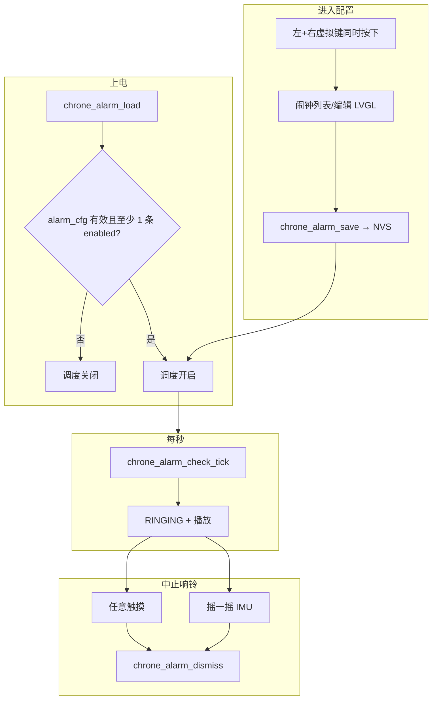

# 阶段 4 — 闹钟实现方案

**状态：** 设计稿（待开发）  
**前提：** 阶段 3 已完成；闹钟需 **手动在设备上配置并写入 NVS**，仅当 NVS 中存在有效且启用的闹钟时才参与调度与响铃。

---

## 1. 目标

| 项 | 说明 |
|----|------|
| 存储 | **4 组**闹钟，`enabled`、时、分、重复类型，掉电保持 |
| 配置入口 | **同时按下底部虚拟键「最左 + 最右」** 进入闹钟配置界面 |
| 触发条件 | 读 NVS 成功且 **至少一条 `enabled=true`** 才启动每秒调度 |
| 到点提醒 | 扬声器播放（I2S）；可选震动 / SK6812（可分期） |
| 停止响铃 | **任意触摸** 或 **摇一摇（MPU6886）** 关闭闹钟 |

---

## 2. 架构



---

## 3. NVS

| 项 | 值 |
|----|-----|
| Namespace | `chrone`（与 `clk_mode` 等同） |
| Key | `alarm_cfg` |
| 格式 | 定长二进制：`hdr` + `CHRONE_ALARM_MAX` 条 `chrone_alarm_t` |

```c
#define CHRONE_ALARM_MAX  4

typedef struct {
    bool     enabled;
    uint8_t  hour;      /* 0–23 */
    uint8_t  minute;    /* 0–59 */
    uint8_t  repeat;    /* DAILY / WORKDAY / ONCE */
    uint8_t  flags;     /* reserved */
} chrone_alarm_t;
```

**调度门控：**

```text
chrone_alarm_scheduling_enabled() ==
    NVS 读取成功 && magic/version 正确 && ∃i: alarms[i].enabled
```

无有效配置时：`check_tick` 直接返回，不响铃、不占用音频。

---

## 4. 进入闹钟配置：左 + 右虚拟键同时按下

### 4.1 硬件区域（Core2 / AWS 惯例）

底部触摸屏划分为三区（与 Core2-for-AWS `Button_Attach` 一致，横屏时需按 **320×240 横屏坐标** 重新标定）：

| 虚拟键 | 参考区域（竖屏 AWS 示例） | 横屏 ChroneCore 需实测 |
|--------|---------------------------|-------------------------|
| 左 | x: 0–106, 宽 106, 底部条 | `chrone_input` 标定 |
| 中 | x: 106–212 | 不参与进闹钟 |
| 右 | x: 212–318 | 与左同时按下才进入 |

**判定逻辑（建议）：**

```text
同一帧或 50ms 防抖窗口内：
  left_pressed  && right_pressed  && !middle_pressed(可选)
→ chrone_app_enter_alarm_screen()
```

- **不要**用「长按屏幕 2s」进闹钟（与点击切换数字/模拟冲突）。
- 响铃中 **不** 用左+右进配置（优先处理停止）；配置页仅在 `IDLE` 时钟态生效。

### 4.2 组件

| 模块 | 职责 |
|------|------|
| `chrone_input` | 封装 FT5x06 + 三区矩形；提供 `chrone_input_left_right_chord_pressed()` |
| `chrone_ui` / `alarm_screen.cpp` | 列表、编辑、Save → `chrone_alarm_set` + `chrone_alarm_save` |
| `chrone_app` | 屏幕路由：`CLOCK` ↔ `ALARM_CONFIG` |

短按单区、秒表三区映射留在 **阶段 5**，与闹钟进页分离。

---

## 5. 闹钟 UI（手动配置）

### 5.1 列表页

```text
┌──────── Alarms ────────┐
│ [ON]  07:30  Daily     │
│ [OFF] 08:00  Workday   │
│ [ON]  22:10  Daily     │
│  (点条目进入编辑)       │
└────────────────────────┘
```

- 返回时钟：单按 **中键** 或屏内 Back（二选一，阶段 4 定一种）。

### 5.2 编辑页

- `enabled` 开关  
- 时、分（+/- 或 roller）  
- 重复：**Daily** / **Workday** / **Once**（P0）；Once 保存须 ≥2 分钟、响后自动关  
- **Save** → 写 NVS → `nvs_commit` → 内存表更新，**无需重启**

### 5.3 与数字/模拟切换的关系

- 时钟屏保留现有 **单击全屏** 切换数字/模拟。  
- 仅当 **未响铃** 且检测到 **左+右 chord** 时进入闹钟配置，避免手势冲突。

---

## 6. 调度与响铃

- 挂接：现有 `chrone_ui` **1 Hz** tick → `chrone_time_get_local_tm` → `chrone_alarm_check_tick`。
- 匹配：时、分、重复类型；同一分钟防重复触发。
- 触发：`chrone_alarm_fire()` → 状态 `RINGING` → `chrone_audio` 播放 PCM/蜂鸣。

---

## 7. 中止响铃（P0）

| 方式 | 行为 |
|------|------|
| **任意触摸** | 响铃时顶层透明可点击层（优先级高于表盘切换）；`LV_EVENT_PRESSED` → `chrone_alarm_dismiss()` |
| **摇一摇** | `chrone_imu_shake_detected()` 为 true 时 dismiss（MPU6886，阈值需实机调） |

-dismiss 后：

- 停止 I2S / `Speaker_Enable(0)`  
- 可选短振/LED 关闭  
- **Once**：到点响一次后 `enabled=false` 并保存；保存时须比「下次触发」≥2 分钟（英文提示 `Time too soon (need +2 min)`）
- 关闭闹钟：编辑界面 **Enabled** 开关  

**30s 超时** 仍保留（需求 FR-ALARM-02），与触摸/摇一摇并存。

响铃中 **不** 响应左+右进闹钟配置。

---

## 8. 音频

- 参考 Core2-for-AWS `speaker.c`（I2S + GPIO0 使能）。  
- 组件 `chrone_audio`：`play_alarm_start` / `play_alarm_stop`。  
- 与麦克风互斥（architecture §12）。

---

## 9. 实施顺序

| 步骤 | 内容 | 验收 |
|------|------|------|
| 4.1 | `chrone_alarm` NVS + `scheduling_enabled` | 串口打印配置 |
| 4.2 | `chrone_input` 左+右 chord 检测 | 同时按两键有 log |
| 4.3 | `check_tick` + RINGING 状态机（先 log，无音频） | 1 分钟后串口触发 |
| 4.4 | 闹钟配置 UI + Save | 重启后配置保留 |
| 4.5 | `chrone_audio` + 触摸 dismiss | 实机响铃并停 |
| 4.6 | `chrone_imu` 摇一摇 dismiss | 晃动停止响铃 |
| 4.7 | 可选 vibration / SK6812 | 增强 |

---

## 10. 需求对照

| ID | 内容 | 本方案 |
|----|------|--------|
| FR-ALARM-01 | ≥3 组，开关/时分/重复 | **固定 4 组** `alarm_cfg` |
| FR-ALARM-02 | 扬声器 + 30s 内可停 | 音频 + 触摸/摇一摇/超时 |
| FR-ALARM-05 | NVS 持久化 | `alarm_cfg` blob |
| FR-INPUT | 虚拟三区 | 阶段 4 仅实现 **左+右 chord**；秒表三区在阶段 5 |

---

## 11. 已确认（阶段 4 定稿）

| 项 | 决定 |
|----|------|
| 闹钟槽位数 | **4 组**（`CHRONE_ALARM_MAX=4`） |
| 进入配置 | **底部虚拟键左+右同时按下** |
| 重复类型 | **Daily** / **Workday** / **Once** |
| 贪睡 Snooze | **阶段 4 不做**（留 V1.1+） |
| 横屏虚拟键区域 | 首版按 AWS 底栏比例映射，实机微调 `chrone_input` |
