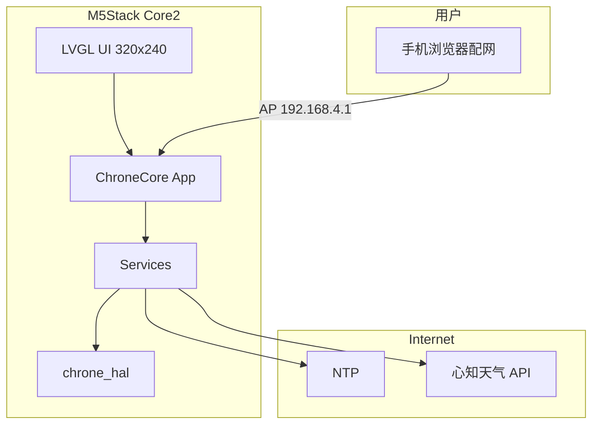
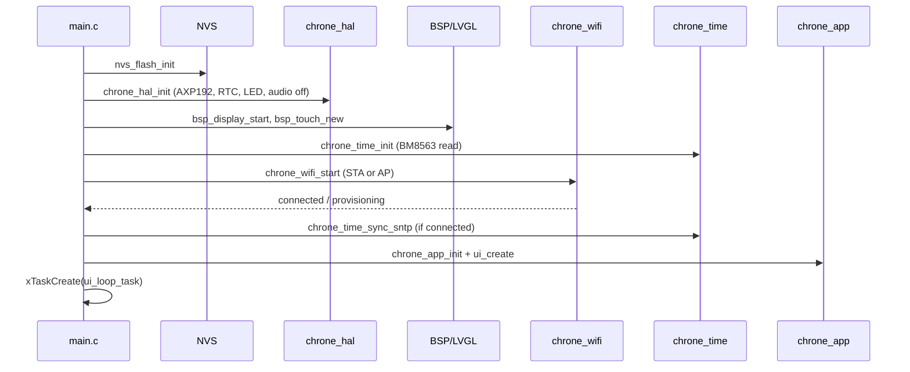
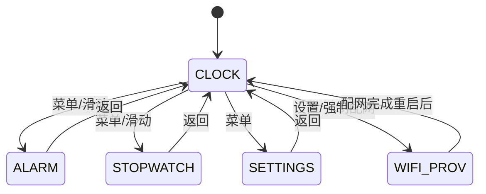
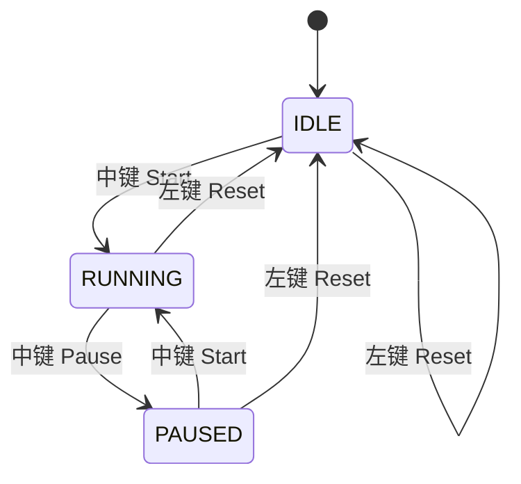
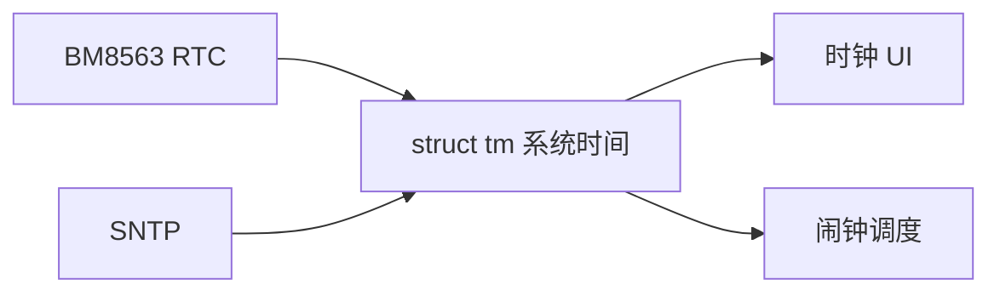
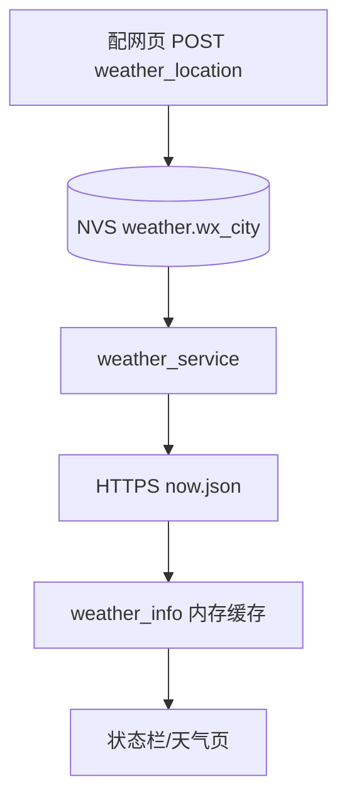
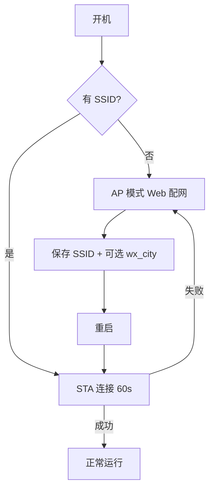
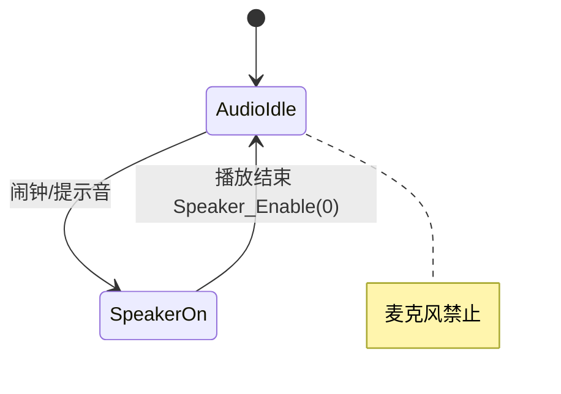

# ChroneCore 架构设计

## 1. 设计目标

- 以 **2048_M5Stack_Core2** 的工程骨架（ESP-IDF 5.5+、M5Stack BSP、LVGL 8）为主干，降低显示与触摸风险。
- 将 **Core2-for-AWS-IoT-Kit** 中外设能力收敛到 **`chrone_hal`**，对上层提供稳定 C API。
- 将 **HourChime** 的 **WiFi AP 配网 + 城市 NVS + 心知天气** 作为独立 **`chrone_net`** 子系统移植。
- 应用逻辑通过 **屏幕状态机 + 服务层** 组织，避免 `app_main` 膨胀。

### 1.1 语言选型（混合架构）

| 层级 | 语言 | 说明 |
|------|------|------|
| HAL / BSP 封装 | **C** | `chrone_hal`、AXP192、震动；`extern "C"` 头文件 |
| 应用 / UI / 联网 | **C++17** | `chrone_app`、时钟 UI、秒表、WiFi 封装 |
| 心知天气服务 | **C**（可选） | 可沿用 HourChime `weather_service.c` |
| 第三方 | C | ESP-IDF、LVGL、M5Stack BSP |

**编译约定：**

- `CONFIG_COMPILER_CXX_EXCEPTIONS=n`，禁用 RTTI。
- C++ 不在 ISR 中抛异常；`bsp_display_lock` 用 RAII `DisplayLock` 包装。
- 新代码默认：硬件驱动 **.c**，业务逻辑 **.cpp**。

---

## 2. 系统上下文



---

## 3. 分层架构

```
┌─────────────────────────────────────────────────────────────┐
│  Presentation (ui/)                                          │
│  clock_digital.c | clock_analog.c | alarm_ui | stopwatch_ui   │
│  settings_ui | status_bar                                    │
├─────────────────────────────────────────────────────────────┤
│  Application (app/)                                          │
│  chrone_app.c — 屏幕切换、全局事件、启动流程                  │
├─────────────────────────────────────────────────────────────┤
│  Services (services/)                                        │
│  time | alarm | stopwatch | weather | wifi_facade | nvs_cfg │
├─────────────────────────────────────────────────────────────┤
│  HAL (components/chrone_hal/)                                │
│  axp192 | bm8563 | sk6812 | mpu6886 | audio | sdcard | btn  │
├─────────────────────────────────────────────────────────────┤
│  Platform (2048 基准)                                        │
│  espressif__m5stack_core_2 | esp_lvgl_port | axp192_esp32   │
├─────────────────────────────────────────────────────────────┤
│  ESP-IDF / FreeRTOS                                          │
└─────────────────────────────────────────────────────────────┘
```

### 3.1 与参考工程映射

| 层 | 2048 | AWS IoT Kit | HourChime | NanoTimer | DS3231_Clock |
|----|------|-------------|-----------|-----------|--------------|
| Platform | BSP 显示/触摸 | — | — | SSD1306 | ILI9488 |
| HAL | axp192, vibration | BM8563, SK6812, I2S, SD | — | DS3231 | DS3231 |
| Services | — | — | weather, wifi AP | stopwatch | — |
| UI | ui_renderer 思路 | Factory clock tab | — | **七段数字钟** | **模拟表盘** |

---

## 4. 目录结构（目标）

```
ChroneCore/
├── main/
│   ├── main.cpp               # NVS → chrone_hal_init → chrone_app_start
│   └── CMakeLists.txt
├── components/
│   ├── chrone_hal/            # C：AXP192、显示、触摸上电
│   ├── chrone_app/            # C++：AppController、启动 UI
│   ├── chrone_ui/             # C++：数字/模拟钟、秒表（后续）
│   ├── chrone_weather/        # C：心知 + city_list（后续）
│   ├── chrone_wifi/           # C++：esp-wifi-connect 适配（后续）
│   ├── axp192_esp32/          # C：自 2048 复用
│   └── vibration/             # C：自 2048 复用
├── managed_components/        # BSP、lvgl（idf.py 拉取）
├── docs/
└── sdkconfig.defaults
```

工程自 **2048_M5Stack_Core2** 脚手架裁剪而来，已移除 `game2048`。

---

## 5. 启动序列



---

## 6. 任务与并发模型

| 任务 | 优先级 | 栈 | 职责 |
|------|--------|-----|------|
| `lvgl` / BSP GUI | 高（BSP 内置） | — | LVGL tick & flush |
| `ui_loop` | 5 | 8KB | 每秒时钟刷新、闹钟检查、UI 请求队列 |
| `wifi` | 5 | 6KB | 连接维护（组件内部） |
| `weather` | 4 | 8KB | HTTP 客户端（一次性或周期） |
| `alarm_play` | 6 | 4KB | 闹钟播放（短生命周期） |

**原则：**

- 不在触摸中断/回调中做 HTTP 或文件 I/O。
- LVGL 仅在持有 `bsp_display_lock` 时更新。
- SD 访问与显示 **互斥**（`chrone_spi_bus_lock`）。

借鉴 2048 的 `render_requested` 标志，改为 **`ui_event_queue`**（可选）：

```c
typedef enum {
    UI_EVT_TICK_1S,
    UI_EVT_WEATHER_UPDATED,
    UI_EVT_WIFI_STATE,
    UI_EVT_ALARM_RING,
} ui_event_t;
```

---

## 7. 屏幕状态机



**STOPWATCH 子状态：**



计时源：`esp_timer_get_time()` 单调时间，暂停时累积 `paused_offset_us`。

---

## 8. 时间子系统



| 阶段 | 行为 |
|------|------|
| 上电 | 从 BM8563 读取 → `settimeofday` |
| WiFi 已连接 | SNTP 同步，写回 BM8563（可选） |
| 无 WiFi | 仅 BM8563 维持 |

---

## 9. 天气子系统



- 白名单校验在 **写入 NVS** 与 **发起请求前** 双重执行。
- 解析逻辑移植自 HourChime `weather_service.c`。

---

## 10. WiFi 子系统



- 组件来源：HourChime `78/esp-wifi-connect`。
- 配网 HTML/高级城市：复用 `wifi_configuration.html` 中 `populateWeatherCities()` 逻辑。
- ChroneCore 在 AP 模式显示提示：SSID、IP、URL（LVGL 全屏页或简单文字）。

---

## 11. 闹钟子系统

详见 [alarm-implementation.md](alarm-implementation.md)。

| 组件 | 说明 |
|------|------|
| 存储 | NVS namespace `chrone`，key `alarm_cfg`（定长 blob） |
| 门控 | 至少一条 `enabled` 才 `chrone_alarm_scheduling_enabled()` |
| 配置入口 | **底部虚拟键左+右同时按下** → 闹钟配置 LVGL（非长按屏幕） |
| 调度 | 1 Hz `chrone_alarm_check_tick()` |
| 提醒 | `chrone_audio` + 可选 `vibration` / SK6812 |
| 停止 | **任意触摸** 或 **MPU6886 摇一摇**（+ 30s 超时） |

---

## 12. 音频与 GPIO0 互斥



**规则：** `chrone_hal` 内全局互斥锁 `s_audio_mux`，`Microphone_Init` 与 `Speaker_Enable(1)` 不可同时持有。

---

## 13. SPI 总线仲裁

显示屏与 TF 卡共享 SPI（AWS BSP 设计）。ChroneCore 定义：

```c
void chrone_spi_bus_lock(TickType_t timeout);
void chrone_spi_bus_unlock(void);
```

- BSP 刷屏路径在 `bsp_display_lock` 内可调用 `chrone_spi_bus_lock`（若 SD 启用）。
- SD 挂载/读写前后必须获取锁。

2048 当前未启用 SD；启用时 **勿** 与 BSP 内部 SPI 初始化冲突，需对照 AWS `spi_mutex` 与 M5Stack BSP 引脚表统一。

---

## 14. NVS 布局

| Namespace | Key | 类型 | 说明 |
|-----------|-----|------|------|
| `wifi` | （组件管理） | — | SSID 列表、`force_ap` |
| `weather` | `wx_city` | string | 心知 location |
| `chrone` | `clk_mode` | u8 | 0=数字 1=模拟 |
| `chrone` | `brightness` | u8 | 0-100 |
| `chrone` | `alarm_cfg` | blob | 闹钟数组序列化 |
| `chrone` | `tz` | string | 时区（可选，v2） |

---

## 15. UI 架构（320×240）

完整视觉规格见 **[clock-ui-reference.md](clock-ui-reference.md)**。

### 15.1 数字时钟（NanoTimer 风格）

- **顶栏**：`yyyy-MM-dd`、中文星期、天气城市/温度（替代 NanoTimer 的 DS3231 温度）。
- **主区**：七段数码管 `HH:MM:SS`（`kSegmentPatterns` + 冒号），秒变化时仅重绘时间区。
- **实现**：`components/chrone_ui/clock_digital.c` + `segment_draw.c`（LVGL Canvas RGB565）。

### 15.2 模拟时钟（DS3231_Clock 风格）

- **静态层**（一次）：黑底、外圈、60 刻度、1–12 数字、轴心帽。
- **动态层**（每秒）：`erase_hand` → 补刻度 → 画时/分/秒针（秒针红色 RGB565 `RED`）。
- **底栏**：`MM/dd` + 中文星期（仅文本变化时重绘，防闪烁）。
- **几何**：圆心约 (160,105)，半径约 90；角度公式同 `AnalogClockView::tip_from_time`。
- **实现**：`clock_analog.c` + `gfx_primitives.c`。

### 15.3 秒表（NanoTimer 风格）

- 显示：`MM:SS.cs` 或 `HH:MM:SS`（`ui_stopwatch.cpp` `format_elapsed`）。
- 状态行：`RUN` / `PAUSE` / `STOP`。
- 刷新：运行中 50ms 周期（`FR-STOPWATCH-05`）。
- 底部三键标签：`重置` | `开始/暂停` | ——。

### 15.4 模式切换

| `clk_mode` (NVS) | 渲染路径 |
|------------------|----------|
| 0 数字 | `chrone_ui_clock_digital_paint` |
| 1 模拟 | `chrone_ui_clock_analog_on_second_tick` |

---

## 16. 安全与配置

- 心知 API Key 仅通过 **环境变量 / 本地 sdkconfig** 注入，`.gitignore` 排除 `sdkconfig` 含密钥文件。
- HTTPS 使用 `esp_crt_bundle_attach`。
- 配网 AP 默认 WPA2，短时开启，完成即切 STA。

---

## 17. 与 ChroneCore README 的关系

仓库根 [README.md](../README.md) 保留 **2048 参考调研**；本产品正式设计以 **本 `docs/` 目录** 为准。实现阶段完成后，根 README 改为面向用户的快速开始说明。
