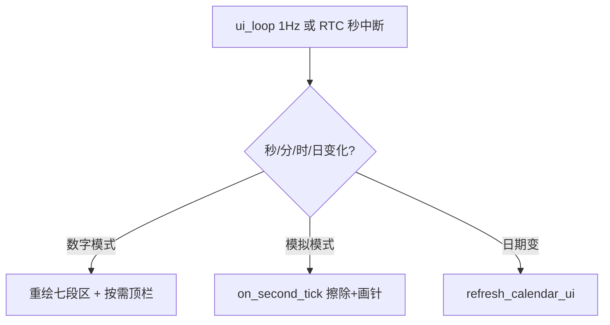

# 时钟 UI 参考（NanoTimer / DS3231_Clock）

ChroneCore 的**数字时钟**与**模拟时钟**视觉与刷新逻辑，分别参考以下两个 RP2040 工程，在 **M5Stack Core2（320×240，横屏）** 上通过 **LVGL 8** 或 Canvas 自绘移植实现。

| 样式 | 参考工程 | 路径 | 核心源文件 |
|------|----------|------|------------|
| **数字时钟** | NanoTimer (PicoChrono) | `C:/Users/sh_mu/code/NanoTimer` | `src/ui/ui_clock.cpp` |
| **模拟时钟** | DS3231_Clock | `C:/Users/sh_mu/code/DS3231_Clock` | `src/clock/analog_clock.cpp`, `gfx_clock.cpp` |

**时间源（ChroneCore）：** BM8563 + SNTP（非 DS3231）；星期由 `struct tm.tm_wday` 计算，**不**沿用 DS3231 的 `day` 星期寄存器语义。

---

## 1. NanoTimer — 数字时钟样式

### 1.1 功能概要

- 显示：**128×64 OLED**，顶栏 + 七段数码管 `HH:MM:SS`
- 顶栏（高度约 20px）：`YYYY-MM-DD`、英文星期（Sun–Sat）、DS3231 温度（`%.1fC`）
- 主区：6 位七段管 + 两个冒号（时:分:秒）
- 刷新：**RTC 秒变化** 时整屏重绘（`clock_paint`），不用软件累加秒

### 1.2 布局常量（128×64 原版）

| 参数 | 值 | 说明 |
|------|-----|------|
| `kHeaderHeight` | 20 | 顶栏高度 |
| 数码管尺寸 | 14×28 px | 单字符位图区域 |
| `kDigitPitch` | 16 | 字符间距（14+2） |
| `kGapAfterPair` | 4 | 时/分对与冒号间距 |
| `kGapAfterColon` | 6 | 冒号与下一数字间距 |
| 时间区 Y | `kHeaderHeight + 8` | 主区垂直起点 |

### 1.3 七段编码

`kSegmentPatterns[10]` 为 7 位掩码（a–g 段），绘制顺序：

```
段 a: 顶横线    段 b,c: 右侧竖   段 d: 底横线
段 e,f: 左侧竖  段 g: 中横线
```

API：`draw_segment_digit(oled, x, y, digit)`、`draw_colon(oled, x, y)`（上下两点）。

### 1.4 ChroneCore 横屏适配（320×240 建议）

```
┌──────────────────────────────────────── 320 ────────────────────────────────────────┐
│ 2026-05-26    星期一                    [天气条]                         [WiFi]      │  ← 顶栏 ~24px
│                                                                                     │
│              ┌──┐┌──┐   ┌──┐┌──┐   ┌──┐┌──┐                                        │
│              │HH││HH│ : │MM││MM│ : │SS││SS│   七段放大（约 2×）                      │  ← 垂直居中
│              └──┘└──┘   └──┘└──┘   └──┘└──┘                                        │
│                                                                                     │
│  [菜单]                                                                              │
└─────────────────────────────────────────────────────────────────────────────────────┘
```

| 适配项 | 建议 |
|--------|------|
| 顶栏 | 日期 `yyyy-MM-dd`；星期用**中文**（需求 FR-CLOCK-04） |
| 温度 | Core2 无 DS3231 片内温；可改为天气温度或隐藏 |
| 七段 | LVGL `lv_canvas` 自绘，或预渲染位图；段宽按屏宽比例放大 |
| 刷新 | 保留「秒 tick 才重绘时间区」；顶栏天气/日期可降频 |

### 1.5 相关 API（NanoTimer）

```cpp
namespace ui {
void clock_paint(SSD1306& oled, const ds3231_time_t& rtc, float temperature_c);
}
```

ChroneCore 目标：

```c
void chrone_ui_clock_digital_paint(const struct tm *tm, const chrone_weather_info_t *w);
```

### 1.6 秒表 UI（同工程，可借鉴）

`ui_stopwatch.cpp`：

- 显示 `MM:SS.cs`（运行时含百分秒）或 `HH:MM:SS`（超过 1 小时）
- 状态：`RUN` / `PAUSE` / `STOP`
- 按键提示：`OK: run/pause  Hold: reset`

逻辑见 `services/stopwatch.cpp`：`base_ms_` + `started_at_ms_`，与 ChroneCore `chrone_stopwatch` 设计一致。

---

## 2. DS3231_Clock — 模拟时钟样式

### 2.1 功能概要

- 显示：**320×480 竖屏** ILI9488 模拟表盘
- 黑底、银色外圈、60 格刻度（每 5 格加粗）
- 1–12 数字刻度（2× 字体），时针/分针/秒针（秒针红色）
- 底部居中：`MM/DD` + 英文星期（2× 字体，灰字）
- 刷新：**秒针每秒** `on_second_tick`；擦除旧针再画新针（局部刷新）

### 2.2 表盘几何（原版 320×480）

| 参数 | 值 |
|------|-----|
| 圆心 `(cx, cy)` | (160, 218) |
| 半径 `radius_` | 128 |
| 时针长度/粗细 | 50 / 7 |
| 分针长度/粗细 | 92 / 5 |
| 秒针长度/粗细 | 112 / 2 |
| `kMinuteHandSweep` | false（分针按整分跳动，可配置 true 平滑） |

### 2.3 配色（RGB565）

| 元素 | 颜色宏 | 说明 |
|------|--------|------|
| 盘面 | `BLACK` | 背景 |
| 外圈 | `0x3186` | 细环 |
| 小刻度 | `0x5ACB` | 每分钟 |
| 大刻度 | `0xDEFB` | 每 5 分钟 |
| 时针 | `0xFFDF` | 近白 |
| 分针 | `0xDEDB` | 银灰 |
| 秒针 | `RED` | 红色 |
| 轴心帽 | `0xCE79` | 中心圆 |

### 2.4 指针角度公式

从 12 点方向顺时针（度）：

```text
ang_s = seconds × 6
ang_m = minutes × 6                    // kMinuteHandSweep=false
      = (minutes + seconds/60) × 6   // kMinuteHandSweep=true
ang_h = (h12 + minutes/60 + seconds/3600) × 30   // h12 = hours % 12
```

尖端坐标（与 DS3231_Clock 一致）：

```c
rad = angle_deg * (π / 180);
tx = cx + (int)(sin(rad) * length);
ty = cy - (int)(cos(rad) * length);
```

### 2.5 秒级刷新算法（`on_second_tick`）

1. 计算新针端点 `(nhx,nhy)` `(nmx,nmy)` `(nsx,nsy)`
2. 用**盘面色** `erase_hand` 擦掉旧秒针；若时/分变化则擦时针/分针
3. 必要时 `redraw_all_ticks()` 或只恢复 `last_drawn_sec_` 一格刻度
4. 重画 1–12 数字（避免被指针覆盖）
5. 按顺序画时针 → 分针 → 秒针 → 中心帽
6. 日期/星期条仅在文本变化时 `paint_calendar_overlay()`（防闪烁）

ChroneCore 在 LVGL 上可：

- **方案 A**：`lv_canvas` + 上述算法直接画 RGB565
- **方案 B**：`lv_line` / `lv_img` 指针图旋转（资源占用更大）

### 2.6 底部日期/星期条

| 项 | DS3231_Clock | ChroneCore |
|----|----------------|------------|
| 日期格式 | `MM/DD` | 可改为 `MM/dd` 或保留 + 年份在顶栏 |
| 星期 | 英文三字母 | **中文**「星期一」等 |
| 位置 | 距底 14px，双行居中 | 横屏 320×240：建议表盘下方 24px 高 |

### 2.7 相关 API（DS3231_Clock）

```cpp
class AnalogClockView {
public:
    void paint_static_dial();              // 一次性：底、圈、刻度、数字、帽
    void on_second_tick(const ds3231_time_t& t);
    void force_hands_sync(const ds3231_time_t& t);
    void refresh_calendar_ui(const ds3231_time_t& t);
};
```

底层图元（`gfx_clock.cpp`）：

```cpp
void fill_rect(...);
void draw_line(..., thickness, color565);  // Bresenham 粗线
void draw_circle(..., radius, thickness, color565);
```

ChroneCore 目标：

```c
void chrone_ui_clock_analog_init(lv_obj_t *parent);
void chrone_ui_clock_analog_on_second_tick(const struct tm *tm);
void chrone_ui_clock_analog_set_calendar(const struct tm *tm);  // 日期/星期变化时
```

### 2.8 ChroneCore 横屏适配（320×240 建议）

| 参数 | 建议值 |
|------|--------|
| 圆心 | (160, 105) |
| 半径 | 88～92（为底栏留空） |
| 指针长度比例 | 保持 h:m:s ≈ 50:92:112 相对半径 |
| 底栏 | 高 28–32px，`MM/dd` + 中文星期 |

---

## 3. 时间/星期数据映射

| 字段 | NanoTimer (DS3231) | DS3231_Clock | ChroneCore (BM8563 + libc) |
|------|-------------------|--------------|----------------------------|
| 年/月/日 | `rtc.year/month/date` | 同左 | `tm_year+1900`, `tm_mon+1`, `tm_mday` |
| 时/分/秒 | `rtc.hours/minutes/seconds` | 同左 | `tm_hour/min/sec` |
| 星期 | `rtc.day` 1=Sun…7=Sat | Sakamoto 推算 | `tm_wday` 0=Sun…6=Sat → 中文表 |

---

## 4. 刷新策略（统一）



- **禁止**用 `vTaskDelay` 累加秒数代替 RTC/NTP。
- 模拟盘静态层（刻度、数字）仅在模式切换或全屏刷新时画一次。

---

## 5. 移植文件对照表

| ChroneCore 目标文件 | 参考来源 |
|---------------------|----------|
| `components/chrone_ui/clock_digital.c` | `NanoTimer/src/ui/ui_clock.cpp` |
| `components/chrone_ui/segment_draw.c` | `ui_clock.cpp` 内 `kSegmentPatterns` |
| `components/chrone_ui/clock_analog.c` | `DS3231_Clock/src/clock/analog_clock.cpp` |
| `components/chrone_ui/gfx_primitives.c` | `DS3231_Clock/src/clock/gfx_clock.cpp` |
| `components/chrone_ui/clock_palette.h` | `analog_clock.cpp` `dial_palette` |
| `services/chrone_stopwatch.c` | `NanoTimer/src/services/stopwatch.cpp` |

---

## 6. 许可证与引用

- **NanoTimer**：MIT（见仓库 LICENSE）
- **DS3231_Clock**：MIT

移植时保留版权注释，并在 `clock_digital.c` / `clock_analog.c` 文件头注明衍生来源。
