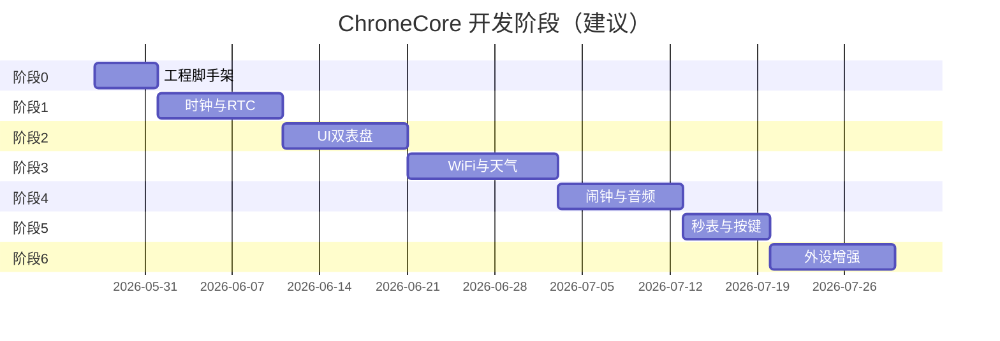

# ChroneCore 项目开发计划

## 1. 项目信息

| 项 | 内容 |
|---|---|
| 项目名称 | ChroneCore |
| 目标硬件 | M5Stack Core2 |
| 软件基准 | `2048_M5Stack_Core2`（ESP-IDF 5.5+） |
| 硬件 API 参考 | `Core2-for-AWS-IoT-Kit` |
| 配网/天气参考 | `HourChime` |
| **数字钟 UI** | `NanoTimer` → `ui_clock.cpp` |
| **模拟钟 UI** | `DS3231_Clock` → `analog_clock.cpp` |
| 文档 | [requirements.md](requirements.md)、[api-reference.md](api-reference.md)、[clock-ui-reference.md](clock-ui-reference.md)、[architecture.md](architecture.md) |

---

## 2. 里程碑总览

---

## 3. 阶段 0：工程脚手架（约 1 周）

### 目标

从 2048 工程复制/裁剪为 ChroneCore 可编译固件，移除游戏相关代码，保留 BSP 与 AXP192。

### 语言约定（阶段 0 起）

- **C：** `components/chrone_hal/`、`axp192_esp32`、`vibration/`
- **C++17：** `main/main.cpp`、`components/chrone_app/`（`CONFIG_COMPILER_CXX_EXCEPTIONS=n`）
- 详见 [architecture.md §1.1](architecture.md#11-语言选型混合架构)

### 任务

| # | 任务 | 产出 | 参考 |
|---|------|------|------|
| 0.1 | 从 2048 复制 HAL 组件与 sdkconfig，新建 ChroneCore 工程根 | 可 `idf.py build` | 2048 |
| 0.2 | **不** 引入 `game2048`；`main` 仅 `chrone_hal` + `chrone_app` | 空壳启动 UI | — |
| 0.3 | `chrone_hal_init()`：AXP192 + BSP 显示 + 背光 | 串口日志 | 2048 `main.c` |
| 0.4 | `chrone_app_start()`：LVGL 显示 “ChroneCore” 占位 | C++ 入口 | — |
| 0.5 | `docs/TODO.md` 跟踪进度 | 待办清单 | — |
| 0.6 | `.gitignore` 含 `build/`、`sdkconfig`、密钥 | 无密钥入库 | — |

### 验收

- [ ] 烧录后屏幕点亮、触摸有日志
- [ ] 无 2048 游戏代码链接

---

## 4. 阶段 1：时间与 RTC（约 1.5 周）

### 目标

BM8563 可用，系统时间正确，为时钟/闹钟提供基础。

### 任务

| # | 任务 | 产出 | 参考 |
|---|------|------|------|
| 1.1 | 新建 `components/chrone_hal/bm8563`，移植 AWS `bm8563.c` 或复用 2048 I2C 总线 | `BM8563_Get/SetTime` | AWS Factory `clock.c` |
| 1.2 | 实现 `chrone_time`：上电读 RTC → `settimeofday` | `chrone_time_get_struct` | architecture §8 |
| 1.3 | 集成 SNTP（`esp_sntp`），WiFi 未连时跳过 | `chrone_time_sync_sntp` | ESP-IDF 例程 |
| 1.4 | 单元测试：串口打印时间，与 PC 差 <5s（已同步） | 日志 | — |

### 验收

- [ ] 重启后时间保持
- [ ] SNTP 成功后时间校准

### 风险

| 风险 | 缓解 |
|------|------|
| I2C 与 2048 AXP192/BSP 冲突 | 统一 `I2C_NUM_0`、GPIO21/22，参考 2048 初始化顺序 |

---

## 5. 阶段 2：时钟 UI（约 1.5 周）

### 目标

数字/模拟双模式，显示日期与星期；视觉分别对齐 **NanoTimer** 与 **DS3231_Clock**。

### 任务

| # | 任务 | 产出 | 参考 |
|---|------|------|------|
| 2.1 | `components/chrone_ui`：主屏框架 + 状态栏（天气/WiFi） | `chrone_ui_init` | 2048 布局 + clock-ui-reference §1.4 |
| 2.2 | 移植 `kSegmentPatterns` + `draw_segment_digit` → `segment_draw.c` | 七段 0–9、冒号 | `NanoTimer/src/ui/ui_clock.cpp` |
| 2.3 | `clock_digital.c`：顶栏 + `HH:MM:SS`，秒 tick 刷新 | `chrone_ui_clock_digital_paint` | NanoTimer `clock_paint` |
| 2.4 | 移植 `gfx_clock` 图元 → `gfx_primitives.c` | line/circle/fill | `DS3231_Clock/src/clock/gfx_clock.cpp` |
| 2.5 | `clock_analog.c`：`paint_static_dial` + `on_second_tick` | 擦针/画针/配色 | `DS3231_Clock/src/clock/analog_clock.cpp` |
| 2.6 | 底栏日期/星期（中文）+ `refresh_calendar_ui` 防闪烁 | 底栏组件 | analog_clock `paint_calendar_overlay` |
| 2.7 | 320×240 几何标定（圆心、半径、字号） | `clock_layout.h` | [clock-ui-reference.md](clock-ui-reference.md) §1.4、§2.8 |
| 2.8 | 设置项：数字/模拟切换写 NVS | `clk_mode` | architecture §14 |
| 2.9 | `ui_loop`：数字 1Hz / 模拟秒 tick | 流畅秒跳 | NanoTimer「RTC 秒变化刷新」 |

### 验收

- [ ] 数字界面与 NanoTimer 布局一致（七段 + 顶栏日期星期）
- [ ] 模拟界面与 DS3231_Clock 一致（刻度、红秒针、银白时分针）
- [ ] FR-CLOCK-01～04 满足 [requirements.md](requirements.md)
- [ ] 模式切换持久化

---

## 6. 阶段 3：WiFi 配网与心知天气（约 2 周）

### 目标

复用 HourChime 热点配网与城市选择，主界面显示天气。

### 任务

| # | 任务 | 产出 | 参考 |
|---|------|------|------|
| 3.1 | 引入 `78/esp-wifi-connect`（`idf_component.yml`） | 组件解析成功 | HourChime |
| 3.2 | 实现 `chrone_wifi`：STA 连接 / AP 配网 / `force_ap` | 与 HourChime 流程一致 | `WIFI_CONFIG_AND_PORTING.md` |
| 3.3 | 开启 `CONFIG_CHRONECORE_WEATHER_CONFIG`，移植 `wifi_configuration_ap.cc` 中 `/advanced/*` 逻辑 | 配网页可选城市 | HourChime |
| 3.4 | 移植 `weather_city_list.c` + `weather_service.c` → `chrone_weather` | HTTPS 请求成功 | HourChime `app/weather/` |
| 3.5 | Kconfig 配置 API Key，默认城市 | 无硬编码密钥提交 | `weather_config.h` 模板 |
| 3.6 | UI 状态栏：城市、温度、现象图标（code 映射表） | 天气可见 | `weather_code_map` |
| 3.7 | AP 模式全屏提示页（SSID、URL） | 用户可配网 | AWS Factory `wifi.c` 文案参考 |

### 验收

- [ ] 手机连接 AP 配置 WiFi 成功
- [ ] 高级页选「北京」等，重启后天气请求 `location=beijing`
- [ ] FR-WEATHER-01～04 满足

### 风险

| 风险 | 缓解 |
|------|------|
| esp-wifi-connect 依赖 C++ / 旧 IDF API | 单独组件编译，必要时局部 patch |
| 心知 Key 配额/网络 | 超时重试、UI 显示 `--` |

---

## 7. 阶段 4：闹钟与扬声器（约 1.5 周）

### 目标

多组闹钟、手动配置写入 NVS、到点发声；**仅当 NVS 存在有效且启用的闹钟** 才参与调度。详见 [alarm-implementation.md](alarm-implementation.md)。

### 任务

| # | 任务 | 产出 | 参考 |
|---|------|------|------|
| 4.1 | `chrone_alarm` NVS（`chrone`/`alarm_cfg`）+ 调度门控 | **4 组**，Once/Daily/Weekday | requirements FR-ALARM |
| 4.2 | `chrone_input`：**左+右虚拟键同时按下** 进闹钟配置 | chord 检测 | AWS `button_left/right` |
| 4.3 | 闹钟 UI：列表、编辑、Save 写 NVS | `alarm_screen` | alarm-implementation §5 |
| 4.4 | 每秒 `check_tick` + 响铃状态机 | RINGING | — |
| 4.5 | `chrone_audio` I2S 播放 | `speaker.c` | AWS Core2 |
| 4.6 | 停止：**任意触摸** + **摇一摇（MPU6886）** + 30s 超时 | dismiss | api-reference `chrone_imu` |
| 4.7 | 可选：`vibration_trigger` + SK6812 | 多模态 | 2048 `vibration` |

### 验收

- [ ] 左+右同时按下进入闹钟页，Save 后重启配置仍在
- [ ] 无 enabled 闹钟时不响铃
- [ ] 设 1 分钟后闹钟，到时播放；触摸或摇一摇可停
- [ ] 麦/喇叭不同时开启（代码审查 + 实测）

---

## 8. 阶段 5：秒表与自定义按键（约 1 周）

### 目标

秒表精确计时，三区按键或 LVGL 按钮控制。

### 任务

| # | 任务 | 产出 | 参考 |
|---|------|------|------|
| 5.1 | `chrone_stopwatch`：`base_ms` + `toggle`/`reset` | 状态机 | `NanoTimer/src/services/stopwatch.cpp` |
| 5.2 | `stopwatch_ui.c`：`format_elapsed`、50ms 刷新 | 百分秒显示 | `NanoTimer/src/ui/ui_stopwatch.cpp` |
| 5.3 | `chrone_input`：触摸三区或 AWS `Button_*` 区域映射 | 左/中/右回调 | AWS `button` + NanoTimer K3/K1 映射 |
| 5.4 | `stopwatch_ui.c` + 屏内按钮冗余 | FR-STOPWATCH-02 | requirements §2.6 |
| 5.5 | 从主菜单进入/退出秒表 | 时钟继续走 | — |

### 验收

- [ ] 启动→暂停→继续→重置 无误
- [ ] 10 分钟误差 <0.1%（相对单调时钟）

---

## 9. 阶段 6：外设增强与收尾（约 1.5 周）

### 目标

集成剩余外设（按优先级），V1.0 发布。

### 任务

| # | 任务 | 优先级 | 参考 |
|---|------|--------|------|
| 6.1 | SK6812 统一 `chrone_led`（配网中=蓝，闹钟=红） | P1 | AWS SK6812 |
| 6.2 | MPU6886 摇一摇关闹钟（若阶段 4 已做则仅调参/亮屏唤醒） | P2 | 阶段 4 `chrone_imu_shake_detected` |
| 6.3 | TF 卡挂载 + SPI 互斥 | P3 | AWS `sdcard` |
| 6.4 | 设置页：亮度、关于、恢复配网 | P1 | 2048 背光 API |
| 6.5 | OTA 分区与升级（可选） | P2 | ESP-IDF OTA |
| 6.6 | 全量测试用例表执行 | — | §10 |

### 验收

- [ ] V1.0 检查表全部通过（[requirements.md](requirements.md) §7）

---

## 10. 测试计划

| 类别 | 用例 |
|------|------|
| 时钟 | 数字/模拟切换；跨午夜日期；星期中文正确 |
| RTC | 断电 24h 后偏差记录 |
| WiFi | 首次配网；换路由器；`force_ap` |
| 天气 | 10 个城市 id；非法 id 拒绝；断网占位 |
| 闹钟 | 单次/每天；响铃停止；贪睡（若实现） |
| 秒表 | 暂停累计；重置；与时钟并行 |
| 音频 | 仅扬声器；禁止麦+喇叭并发 |
| 压力 | 连续运行 24h 无崩溃，堆最低值记录 |

---

## 11. 人员与分工建议（可选）

| 角色 | 负责阶段 |
|------|----------|
| 嵌入式主程 | 0～1、3、4、6 HAL |
| UI | 2、5、3.7 |
| 联网 | 3、天气 |

---

## 12. 交付物清单

| 交付物 | 路径 |
|--------|------|
| 可烧录固件 | `build/chrone-core.bin` |
| 设计文档 | `docs/*.md` |
| 配置说明 | `docs/requirements.md` + 根 README 快速开始（阶段 6 补充） |
| 配网说明 | 用户连接 `ChroneCore-XX` 热点 |

---

## 13. 后续版本（V1.1+）

- 多时区、农历
- 声学 WiFi 配网（HourChime `CONFIG_USE_ACOUSTIC_WIFI_PROVISIONING`）
- 自定义铃声（TF 卡）
- 整点报时 / 语音播报
- ESP RainMaker 或 Home Assistant（可选）

---

## 14. 即时下一步（Action Items）

1. **执行阶段 0**：从 2048 复制工程到 ChroneCore 并确保编译通过。
2. **添加** `idf_component.yml` 声明 `78/esp-wifi-connect`（版本对齐 HourChime）。
3. **创建** `components/chrone_hal` 空壳与 `chrone_time.c`。
4. **将** `HourChime/app/weather/weather_city_list.c` 列入移植清单（注意 LICENSE）。
5. **阅读** [clock-ui-reference.md](clock-ui-reference.md)，阶段 2 从 `NanoTimer/ui_clock.cpp` 与 `DS3231_Clock/analog_clock.cpp` 复制算法骨架。

完成阶段 0 后，以 [architecture.md](architecture.md) 为准展开阶段 1 编码。
