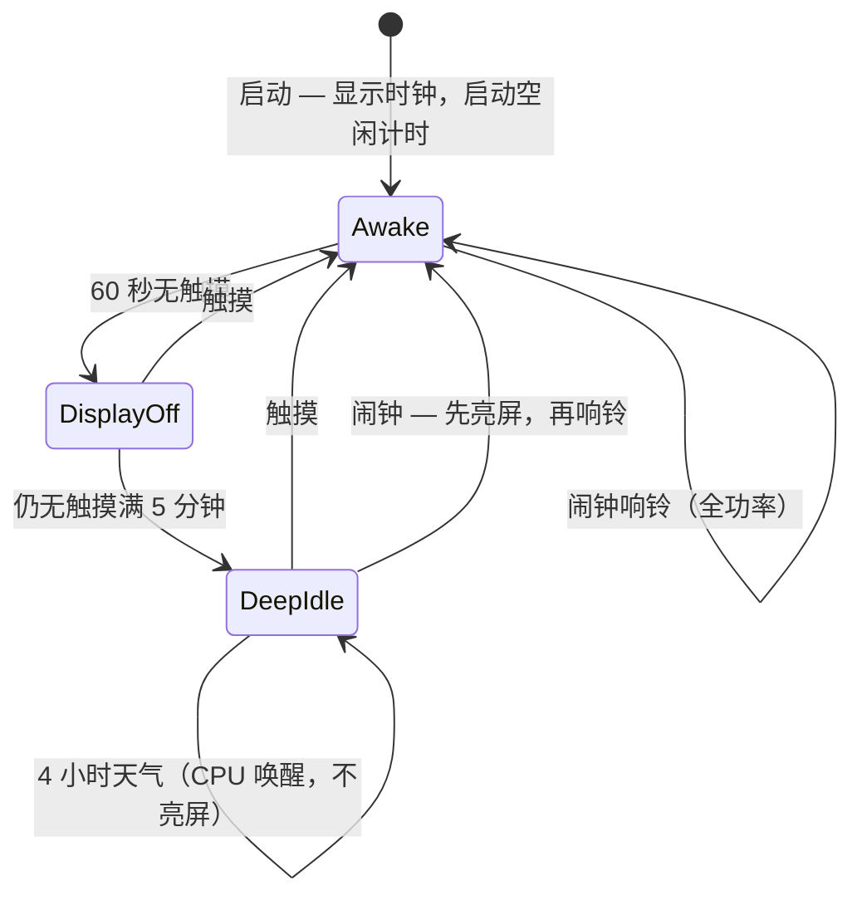

# 电源管理设计（M5Stack Core2 / Core2 for AWS）

ChroneCore 节能策略：触摸亮屏、空闲超时、AXP192 外设电源门控、ESP32 浅睡配合 WiFi 调制解调器省电，以及降低后台网络活动。

**状态：** 仅规划（固件尚未实现）。  
**最后更新：** 2026-05-27

相关文档：[architecture.md](architecture.md)、[requirements.md](requirements.md)、[api-reference.md](api-reference.md) §1.2（AXP192 / 显示 / WiFi）。

---

## 1. 目标

| 目标 | 指标 |
|------|------|
| 冷启动 | **先显示时钟**（唤醒态）；UI 就绪后再启动空闲计时 |
| 显示空闲 | **60 秒**无触摸 → 关背光（面板可仍供电） |
| 深度空闲 | 进入显示空闲后 **5 分钟** → 关闭 AXP 供电轨 + CPU 浅睡 |
| 唤醒 | 触摸恢复显示与外设；WiFi 保持连接（无需重新配网） |
| 天气 | 仅 **4 小时**后台 HTTPS；触摸亮屏 **不**拉取 |
| 闹钟 | 到点：**先亮屏**，再响铃（显示 + 音频 + 触觉） |

**当前不在范围内：** MPU6886 摇晃唤醒、SK6812 LED 灯效、会断开 WiFi 的 ESP **深度睡眠**。

---

## 2. 术语：三级功耗档位

勿将 Core2 上的「deep sleep」与单一机制混为一谈。

| 档位 | 名称 | ESP32 CPU | WiFi | 显示 / 外设 | ChroneCore 用途 |
|------|------|-----------|------|-------------|-----------------|
| **A** | 显示关闭（Display idle） | 运行中 | 可选调制解调器省电 | 背光关（面板可仍供电） | 60 秒无触摸后的第一步 |
| **B** | **深度空闲（Deep idle）**（规划） | **浅睡（Light sleep）** | **保持 STA**，调制解调器省电 | AXP：LCD 供电轨关、扬声器/震动关等 | 主要「深度节能」 |
| **C** | 芯片深度睡眠 | Deep sleep | **断开** | 全部关闭 | **不适合** 常亮时钟 + WiFi |

用户需求——「**只给 WiFi 供电**，触摸唤醒其余一切」——对应 **档位 B + AXP 电源门控**，而非 `esp_deep_sleep()`。

---

## 3. 硬件：AXP192 供电轨（Core2 / Core2 for AWS）

参考：[M5 Core2 文档](https://docs.m5stack.com/en/core/core2)、本仓库 `components/axp192_esp32`、Espressif **Core2-for-AWS-IoT-Kit** 的 `core2forAWS`（`Core2ForAWS_Display_SetBrightness` → **DCDC3** 电压）。

| 供电轨 | 典型负载 | 深度空闲 | 触摸唤醒后 |
|--------|----------|----------|------------|
| **DCDC3** | LCD **背光** | 关 | 开 + 恢复亮度（0–100） |
| **LDO2** | LCD **逻辑电**（PERI_VDD） | 关 | 开；可能需要 **面板重新初始化** |
| **LDO3** | **震动**马达 | 关 | `vibration_init` / BSP |
| **DCDC1** | MPU6886 IMU（可选） | 关 | IMU 集成前保持关 |
| **AXP GPIO2** | 扬声器功放使能（NS4168） | 关 | 播放音频时开 |
| **AXP GPIO1** | 板载 LED | 可选关 | 按需 |
| **ESP32 + RF** | WiFi / 蓝牙 | 设备「开机」期间 **常开** | 无法经 AXP 单独关断 |
| **AXP192 + I2C0** | PMU、触摸总线 | **必须保持** | 触摸 + 重新上电时序 |
| **FT6336U** | 电容触摸（I2C，INT 接 GPIO39） | 保持供电 | **唤醒源** |
| **BM8563** | RTC（I2C1，BSP） | 保持供电 | 走时、闹钟、可选定时唤醒 |

**做不到：** ESP 仍在运行时用 AXP 关掉「WiFi 模块」——WiFi 在 SoC 内部。

**实现说明：** ChroneCore 中现有的 `axp192_set_lcd_power()` 仅切换 **DCDC3**。完整关屏应同时使用 **LDO2**（及 DCDC3 背光），与 AWS / 原理图意图一致——实现时需修正。

---

## 4. 当前固件基线（ChroneCore）

| 领域 | 现状 |
|------|------|
| AXP192 | `chrone_hal_init()`：DCDC1 3.3 V 供 IMU 轨；启动时 DCDC3 + LDO2 为 LCD 使能 |
| 背光 | 启动时 `bsp_display_brightness_set(60)`；**常亮** |
| 触摸 | FT6336 经 BSP I2C；`app_poll` **50 ms** + LVGL 输入设备 |
| UI 节拍 | 时钟屏 **1 Hz** 刷新 |
| WiFi | `chrone_wifi_start()` → STA；NVS 中的 **`sleep_mode` 在 `WifiStation::Start()` 里尚未应用** |
| AP 配网 | `WIFI_PS_NONE`（正确） |
| 天气 | `WEATHER_REFRESH_INTERVAL_MS` = **1 小时**；`weather_task` 中 HTTPS 循环 |
| 闹钟 | `app_poll` 内 1 Hz `chrone_alarm_check_tick`；响铃超时 60 s；响铃强制 UI/音频 |

---

## 5. 天气同步：4 小时

| 项 | 计划 |
|----|------|
| 间隔 | `4 * 60 * 60 * 1000` ms（替换 `weather_service.c` 中 1 小时常量） |
| 策略 | **不**为天气点亮面板；触摸唤醒 **不**发起 HTTP |
| 触发 | **仅定时后台**（深度空闲下短时 CPU 唤醒，如 `esp_timer`） |
| UI 更新 | 底栏天气在**下一次定时**拉取后刷新（唤醒后可能短暂显示旧数据） |
| 失败 | 下一 4 小时窗口重试 |

---

## 6. 用户可见状态机

### 6.1 档位 A — 显示关闭（60 秒无触摸）

- 背光设为 **0**（`bsp_display_brightness_set(0)` 或 `axp192_set_lcd_backlight(false)`）。
- ESP 与 LVGL 继续运行；**触摸轮询保持**（点击亮屏必需）。
- 可选：背光关闭时降低 LVGL 刷新（暂停 1 s 节拍）。

### 6.2 档位 B — 深度空闲（更长时间无触摸）

**已锁定：** 仅在显示空闲持续 **5 分钟**（300 s）后进入，**不是** 60 秒时直接进入。自上次触摸起：**60 s → 关显示**，再 **+5 min → 深度空闲**（约 **6 分钟** 进入深度空闲）。

**进入睡眠前（软件）**

1. 暂停 LVGL 1 s 节拍与非必要定时器；保留最小触摸路径。
2. 闹钟：优先 **BM8563 闹钟 IRQ**（若已接到 ESP）；否则浅睡中 **按分钟唤醒** 以执行 `chrone_alarm_check_tick`。
3. WiFi：`esp_wifi_set_ps(WIFI_PS_MIN_MODEM)` 或按 NVS `sleep_mode` 使用 `MAX_MODEM`。
4. 可选：`esp_lcd_panel_disp_on_off(false)` 减少 SPI 流量。

**AXP 关断顺序**

1. 扬声器功放关（GPIO2）。  
2. LDO3 关（震动）。  
3. DCDC3 关（背光）。  
4. LDO2 关（面板 VDD）。  
5. DCDC1 关（IMU，可选）。

**ESP**

- 配置唤醒源：**GPIO39**（FT6336 INT）、**esp_timer**（闹钟分钟、4 h 天气、SNTP 维护）。  
- 循环：`esp_light_sleep_start()` → 处理唤醒原因 → 再次睡眠。

### 6.3 触摸唤醒 — 恢复外设

1. 退出浅睡（WiFi 协议栈恢复；关联通常保留）。  
2. AXP 上电顺序：**LDO2 → DCDC3 → 亮度**；需要触觉时再开 LDO3；播放时再开扬声器。  
3. 显示：若仅关背光 → 刷新 UI；若 LDO2 曾关 → **`chrone_hal_display_resume()`**（面板 + LVGL 全量重绘）。  
4. 恢复 50 ms 输入轮询、1 s 时钟节拍，重置 60 s / 5 min 空闲计时。  
5. 天气：唤醒 **不**做 HTTPS；UI 显示上次成功拉取的数据，直至 **4 h** 后台更新。

---

## 7. WiFi 省电策略

| 场景 | WiFi |
|------|------|
| 唤醒 / 显示关闭 | 应用 NVS `sleep_mode` → `WifiStation::SetPowerSaveMode(true)` → `WIFI_PS_MIN_MODEM` |
| 用户交互 | 可选短时 `WIFI_PS_NONE`（如 5–10 s）以加快网络响应 |
| 深度空闲 + 浅睡 | 保持 STA；调制解调器随 DTIM 睡眠；CPU 睡眠 |
| AP 配网 | `WIFI_PS_NONE`，全亮度 |
| 闹钟响铃 | 唤醒态；与唤醒时相同的 WiFi PS；响铃不依赖网络 |

**待补齐：** 在 `chrone_wifi_start()` STA 连接成功后读取 NVS `sleep_mode` 并调用 `SetPowerSaveMode`。与显示档位联动（关屏时更积极省电）。

**深度空闲中避免：** 已连接时周期性 WiFi 扫描（`WifiStation` 扫描定时器——空闲时需确认行为）。

---

## 8. 闹钟、SNTP 与例外

| 功能 | 深度空闲行为 |
|------|----------------|
| 闹钟调度 | 分钟唤醒或 BM8563 IRQ；勿仅依赖 50 ms 轮询 |
| 响铃 | **先亮屏**（退出深度空闲 + 完整显示路径），再音频、触觉、关闭 UI — 不可黑屏仅响 |
| SNTP | 在定时唤醒窗口内偶尔同步，非持续 |
| 秒表（未来） | 运行中禁止进入深度空闲 |
| 配网 UI | 全功率；不进入深度空闲 |

---

## 9. 规划中的软件模块

| 模块 | 职责 |
|------|------|
| **`chrone_power`**（新建） | `display_wake()`、`display_sleep()`、`deep_idle_enter()`、`deep_idle_exit()`、空闲计时、唤醒原因 |
| **`chrone_hal` 扩展** | 背光 0–100；LDO2/DCDC3/LDO3/扬声器轨；可选 `display_resume()` |
| **`app_poll`** | 触摸空闲时间戳；深度空闲中除唤醒桩外跳过重轮询 |
| **`chrone_wifi`** | 连接时应用 `sleep_mode`；省电档位与 WiFi PS 联动 |
| **`weather_service`** | 4 h 间隔；**仅后台拉取** |
| **NVS `chrone`** | `blank_timeout_s`（60）、`deep_idle_after_display_off_s`（300）、`sleep_wifi` |

架构文档中已有 NVS 键：`brightness`（0–100）。

---

## 10. 风险与 bench 测试

| # | 风险 | 缓解 / 测试 |
|---|------|----------------|
| 1 | LDO2 关闭后触摸失效 | 确认 FT6336 仍在 3.3 V 轨；测 GPIO39 唤醒 + I2C 读 |
| 2 | LDO2 周期后面板花屏 | 定义 `display_resume()` 重新初始化路径；测唤醒延迟 |
| 3 | 浅睡 + WiFi | IDF 调制解调器睡眠配合浅睡；记录断连/重连 |
| 4 | I2C 总线争用 | AXP / 触摸 / 触觉串行化（沿用现有触觉节流模式） |
| 5 | BM8563 INT 未接到 ESP | 闹钟回退为 esp_timer 分钟唤醒 |
| 6 | `axp192_set_lcd_power` 与 LDO2 | 深度空闲实现前修正 API 映射 |

---

## 11. 分阶段实现路线图

| 阶段 | 交付物 | 节能效果 |
|------|--------|----------|
| **P0** | 天气 **4 h**；STA 从 NVS 应用 `sleep_mode`；60 s → 关背光 | 中等 |
| **P1** | 触摸亮屏；第二超时 → AXP 关轨（显示深度关断） | 高 |
| **P2** | ESP **浅睡** + GPIO39 触摸唤醒；睡眠中闹钟/天气定时器 | 很高 |
| **P3** | BM8563 闹钟 IRQ（若硬件支持）；优化 `display_resume` | 体验 + 精度 |

V1 时钟类产品 **不要** 上 **ESP 深度睡眠**（档位 C）。

---

## 12. 已锁定产品参数

实现前已确认的决定：

| # | 参数 | 决定 |
|---|------|------|
| 1 | **关屏超时** | 最后一次触摸后 **60 s**（唤醒态下） |
| 2 | **进入深度空闲** | 进入显示关闭后 **5 min**（非 60 s 立即进入） |
| 3 | **冷启动** | **先唤醒** — 显示时钟，再启动空闲计时（非启动即深度空闲） |
| 4 | **天气（4 h）** | **仅后台定时器** — 触摸唤醒不发起 HTTPS |
| 5 | **闹钟触发** | **必须先亮屏**再响（不可关屏仅声音/震动） |

**空闲时间线（自上次触摸起）：**

- `0–60 s` — 唤醒（背光开）  
- `60 s` — 显示关闭（背光 0，触摸仍可唤醒）  
- `60 s + 5 min` — 深度空闲（AXP 外设关 + 浅睡）

---

## 13. 参考仓库

| 来源 | 用途 |
|------|------|
| [m5stack/M5Core2](https://github.com/m5stack/M5Core2) | 旧版 `MPU6886.cpp`、示例 |
| [m5stack/M5Unified](https://github.com/m5stack/M5Unified) | `MPU6886_Class`、统一电源 |
| [m5stack/MPU6886-idf](https://github.com/m5stack/MPU6886-idf) | ESP-IDF IMU 驱动（可选） |
| 本地 `Core2-for-AWS-IoT-Kit` | `core2forAWS/mpu6886`、`Display_SetBrightness`、`BM8563_SetAlarmIRQ` |
| 本地 `2048_M5Stack_Core2` | `imu_mpu6886`、`axp192`、BSP 亮度 |
| HourChime / `chrone_esp_wifi_connect` | `sleep_mode` UI + `SetPowerSaveMode` |

---

## 14. 摘要

- **启动：** 立即显示时钟；省电计时在此之后启动。  
- **天气：** 仅 **4 h** 后台更新；触摸唤醒不触发 HTTP。  
- **空闲：** **60 s** → 关显示；**+5 min** → 深度空闲（浅睡 + AXP 外设关）。  
- **闹钟：** 先唤醒显示，再响铃。  
- **WiFi：** 保持关联；深度空闲使用 **WIFI_PS_*** 与 CPU 浅睡——不能单独对 RF 做 AXP 门控。
