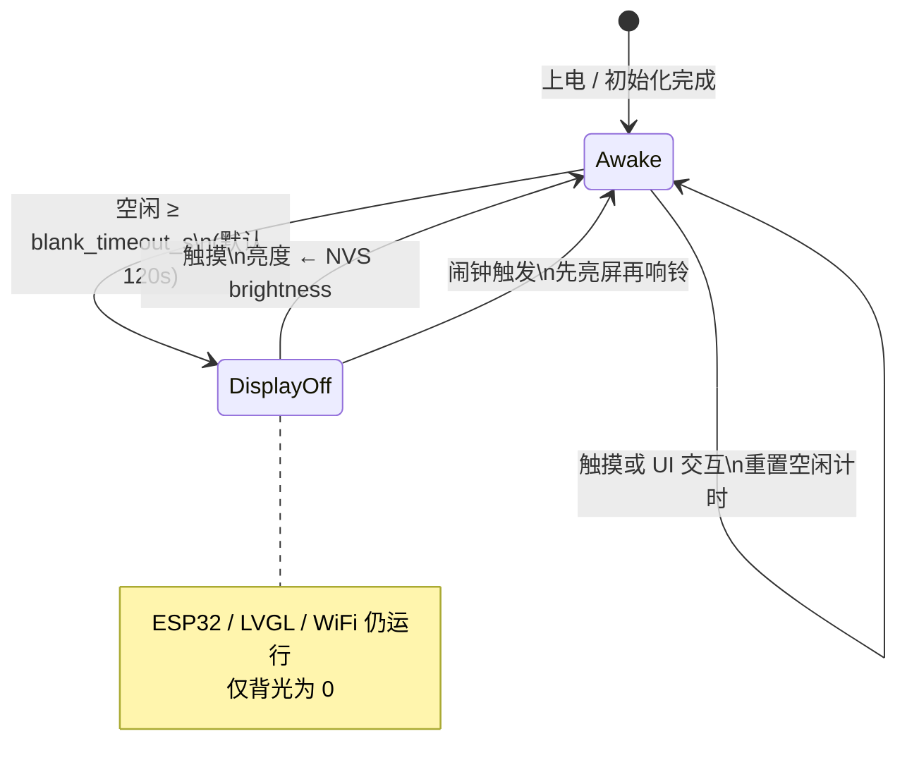
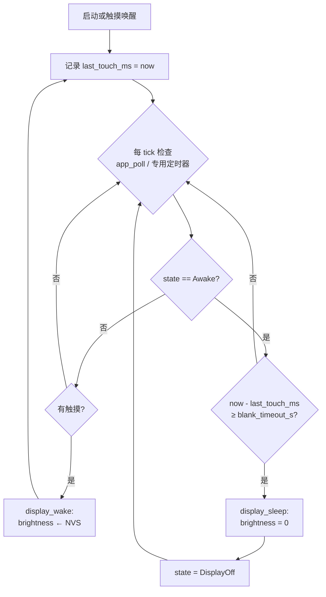
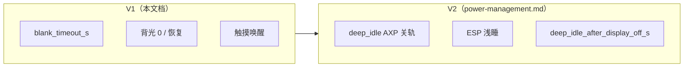
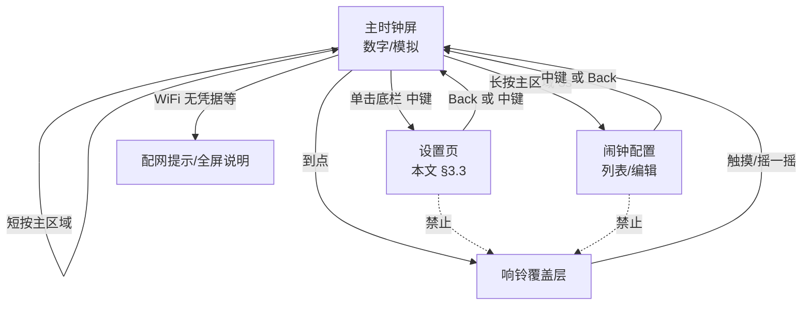
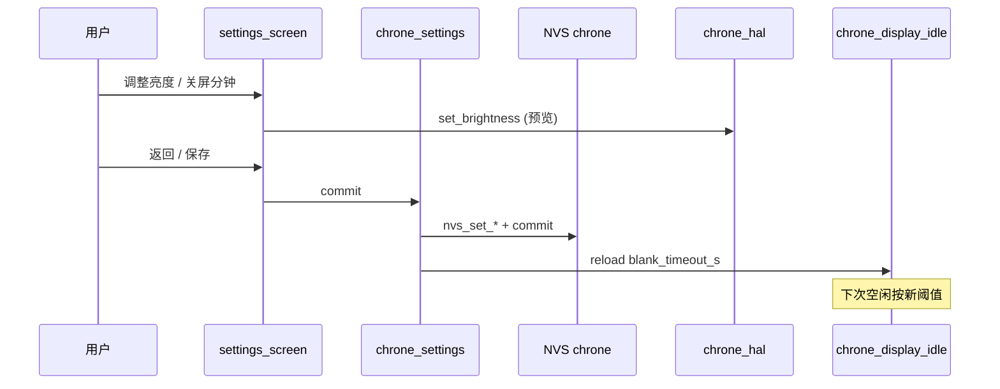

# 设备设置与显示空闲（关屏节能）需求

ChroneCore 在 **完整电源管理（`power-management.md`）尚未落地** 的前提下，先交付 **「关背光节能 + 触摸亮屏」** 与 **设备端设置页（NVS 持久化）**。本文档为评审用需求说明，**不含实现代码**。

**状态：** 需求已定稿（待评审）  
**最后更新：** 2026-06-03  
**菜单与入口：** 见 **[setup-hub-design.md](setup-hub-design.md)**（长按 3s → **Settings** Hub，短振确认；闹钟 + Display + Sound & vibration）  
**关联文档：** [power-management.md](power-management.md)（长期方案）、[architecture.md](architecture.md) §14、[requirements.md](requirements.md)、[api-reference.md](api-reference.md) §1.1

---

## 1. 背景与范围裁剪

### 1.1 为何先做「关屏」

| 完整电源管理（延后） | V1 先做（本文档） |
|----------------------|-------------------|
| AXP 关断 LDO2/LDO3、扬声器轨 | **仅背光 → 0**（`bsp_display_brightness_set(0)`） |
| ESP32 浅睡 + GPIO39 唤醒 | ESP32 **持续运行** |
| 深度空闲 5 分钟计时 | **不实现** |
| WiFi 与显示档位联动 | 可选沿用配网页 `sleep_mode`（WiFi PS），**与关屏解耦** |

关屏后：LVGL、触摸轮询、闹钟 1 Hz 调度、WiFi/天气后台 **仍运行**，仅用户看不见背光，已能明显降低观感功耗与部分背光耗电。

### 1.2 与「配网页睡眠模式」的区别

| 名称 | 存储 | 含义 |
|------|------|------|
| **显示空闲（Display idle）** | NVS `chrone` / `blank_timeout_s` | 无触摸 → 背光 0 |
| **配网页「启用睡眠模式」** | NVS `wifi` / `sleep_mode` | WiFi 调制解调器省电，**不是关屏** |

用户口语中的「进入睡眠」在 V1 中 **仅指显示空闲（关背光）**。

---

## 2. 显示空闲（关屏节能）— 核心行为

### 2.1 已锁定参数（V1）

| 参数 | 值 | 说明 |
|------|-----|------|
| 默认无触摸关屏时间 | **120 秒（2 分钟）** | 写入 NVS 默认值；设置页可改（见 §4） |
| 关屏动作 | `bsp_display_brightness_set(0)` + **暂停 LVGL 触摸** | 不关 DCDC3（与 BSP/FT5x06 共用 I2C，关断会触发触摸读失败重启）；关屏时由 `app_poll` 直读触摸唤醒 |
| 亮屏动作 | 背光恢复为 **NVS `brightness`** | 非固定 60 |
| 触摸唤醒 | **任意有效触摸** | 与现有时钟/闹钟触摸路径一致，重置空闲计时 |
| 冷启动 | 先 **亮屏**（用户亮度），再启动空闲计时 | 不启动即关屏 |
| 闹钟响铃 | **先亮屏**（用户亮度），再声音/震动 | 与 [power-management.md](power-management.md) §6 一致 |

### 2.2 状态机



### 2.3 空闲计时流程



### 2.4 模块职责（规划）

| 模块 | 职责 |
|------|------|
| **`chrone_display_idle`**（新建，或并入 `chrone_power` 的 V1 子集） | 状态机、`last_touch_ms`、`blank_timeout_s` 读取、调用 HAL 亮/灭屏 |
| **`chrone_hal`** | `chrone_hal_set_brightness(u8)`、`chrone_hal_display_wake()` / `display_sleep()`；启动时从 NVS 加载亮度 |
| **`app_poll` / `chrone_input`** | 任意触摸 → 通知 `chrone_display_idle_on_touch()` |
| **`chrone_alarm`** | 进入响铃前 → 强制 `display_wake()` |
| **设置页** | 修改 `brightness`、`blank_timeout_s` 等并写 NVS |

### 2.5 与完整电源管理的关系



实现 V2 时：**复用同一套 `blank_timeout_s` 与触摸时间戳**，在 `DisplayOff` 持续满 `deep_idle_after_display_off_s` 后再进入深度空闲。

---

## 3. 设备配置与菜单（摘要）

> **完整菜单、手势、线框、子页说明：** [setup-hub-design.md](setup-hub-design.md)  
> 下文仅保留与本文件（关屏节能 + NVS）直接相关的内容。

### 3.1 入口（已拍板）

| 操作 | 结果 |
|------|------|
| 主时钟 **长按表盘 3 s** | **Settings** 主菜单 + **短振** → Alarms / Display / Sound & vibration… |
| 主时钟 **短按表盘** | 数字↔模拟（**不进** Settings） |
| Settings / 子页 / 闹钟 | **仅顶栏 `< Back`** 逐级返回；Hub Back → 时钟 |
| 主时钟底栏左/中/右 | **无功能**（不设进菜单） |

~~底栏中键~~、~~Clock face 菜单项~~、~~长按直进闹钟~~ **已废弃**。

### 3.2 子页与 NVS（映射）

| Settings 菜单行 | 子页 | Hub 行右侧摘要示例 | MVP |
|----------------|------|-------------------|-----|
| Alarms | 闹钟列表/编辑 | `2 enabled` / `None` | ✓ |
| Display | 亮度 + 关屏时间 | `60% · 2m` | ✓ |
| Sound & vibration | 音量 + 震动 | `68% · Med` | ✓ |
| Network / About | P2 | 仅 `>`（无摘要） | P2 |

行布局详见 [setup-hub-design.md](setup-hub-design.md) §6。

表盘 `clk_mode`：**仅短按主时钟**，不在 Settings 菜单。

配置树内触摸 **不计入** 关屏空闲（§2）。**Settings 内点按/拨动/Back 均有震动反馈**，见 [setup-hub-design.md](setup-hub-design.md) §4。

---

### 3.3 历史草案（已废止，仅供对照）

<details>
<summary>点击展开：原「中键进 Settings」单页方案（勿按此实现）</summary>

### 3.2 如何进入设置页（导航入口）— 已废止

> 初版文档只写了「入口待选一」，未写清操作步骤；本节为 **V1 锁定方案**，并与 **当前已实现的固件手势** 对照。

#### 3.2.1 V1 推荐入口（已定）

| 操作 | 条件 | 结果 |
|------|------|------|
| **单击底部虚拟键「中」** | 当前为 **主时钟屏**；**非**闹钟响铃中；**非**已在设置/闹钟编辑页 | 进入 **设置页** |
| **单击 `< Back`** 或 **中键**（实现时二选一或等价） | 当前在 **设置页** | 返回主时钟屏；若有未保存修改则先 commit 或提示 |

**为何选中键：** 底栏三区已与 [chrone_input.h](../components/chrone_input/include/chrone_input.h) 对齐（左/中/右各约 106×60）。闹钟配置页已用 **中键返回时钟**；主时钟上 **中键尚未占用**。不与「长按 3s 进闹钟」、短按切换表盘冲突。

**首次使用提示（可选 P1）：** 主时钟底栏中间区域首次显示淡色 `Settings` 或齿轮图标 3 天，写入 NVS `hint_settings_seen=1` 后隐藏。

#### 3.2.2 当前固件已有手势（实现对照，非设置入口）

下列为 **今天代码里已有** 的行为，设置页 **不得占用** 同一手势：

| 手势 | 界面 | 行为 | 代码/文档依据 |
|------|------|------|----------------|
| **短按** 时钟主区域（非底栏） | 主时钟 | **数字 ↔ 模拟** 表盘切换，写 NVS `clk_mode` | `digital_clock.cpp` `tap_layer` CLICKED |
| **长按 3 s** 时钟主区域 | 主时钟 | 进入 **闹钟配置**（列表/编辑） | `CLOCK_LONG_PRESS_MS` → `chrone_ui_show_alarm_config` |
| **中键单击** | 闹钟配置页 | **返回主时钟** | `app_poll.cpp` |
| **任意触摸** / **摇一摇** | 闹钟响铃中 | **停止响铃** | `chrone_alarm` + `app_poll` |
| 文档中的 **左+右同时按** | 主时钟 | 设计为进闹钟（HourChime 习惯） | [alarm-implementation.md](alarm-implementation.md)；**当前主路径为长按 3s**，L+R 可作增强 |

**未实现（架构/requirements 曾规划，V1 设置不依赖）：** 上/下滑切换「时钟 / 秒表 / 设置」菜单。

#### 3.2.3 全应用界面导航图



**互斥规则：**

- `CHRONE_ALARM_STATE_RINGING` 时：**不响应**进设置、进闹钟编辑。  
- 已在 **设置页** 时：短按主区域 **不** 切换表盘（无 tap layer 或忽略）。  
- **配网 AP 全屏** 期间不进入设置（与闹钟相同，全屏专用流程）。

#### 3.2.4 入口方案对比（历史草案，供评审留档）

| 方案 | 操作 | 结论 |
|------|------|------|
| **B 中键单击** | 底栏中 | **V1 采用** |
| A 上/下滑 | 需新手势识别 | 留 V1.1（易与表盘/列表滚动冲突） |
| C 独立「功能菜单」 | 时钟/闹钟/秒表/设置 | 工作量大，V2 |
| 底栏左/右长按 | 与闹钟 L+R 文档混淆 | 不采用 |

---

### 3.3 设置页界面规格（线框与功能说明）

**分辨率：** 320×240，横屏；风格对齐 [alarm_screen.cpp](../components/chrone_ui/alarm_screen.cpp)（顶栏 + 可滚动列表）。

#### 3.3.1 线框总览

**MVP（P0/P1 首批实现）：**

```
┌──────────────────────────── 320 ────────────────────────────┐
│  [< Back]              Settings                    y:0–32  │ 顶栏固定
├─────────────────────────────────────────────────────────────┤
│  Brightness                                                 │
│  [==========○----------]  60%                    row ~40   │ 滑条 + 右侧数值
│                                                             │
│  Display off after                                          │
│  [ 1 ] [ 2 ] [ 3 ] [ 5 ] [10 ] min               row ~88   │ 单选预设，当前项高亮
│  No touch → backlight off                                   │ 灰色说明一行
│                                                             │
│  (P1 起下方继续，MVP 可截断到此)                              │
├─────────────────────────────────────────────────────────────┤
│  左虚拟键区      │  中（返回时钟）  │  右虚拟键区          │ y:180–240
└─────────────────────────────────────────────────────────────┘
```

**完整版（P1/P2 在 MVP 下方滚动）：**

```
│  Alarm volume                                               │
│  [======○-------------]  68%    [ Preview ]                   │
│                                                             │
│  Vibration   ( ) Off  (•) Weak  ( ) Med  ( ) Strong          │
│                                                             │
│  Clock face   (•) Digital   ( ) Analog                      │
│                                                             │
│  Wi-Fi        [ Reconfigure… ]  → force_ap + 重启说明       │
│                                                             │
│  About        ChroneCore v0.1.0                             │
│              ESP-IDF 5.5 · Core2                            │
```

#### 3.3.2 逐项功能说明（界面文案 + 交互 + 存储）

| 行序 | 界面标题（英文） | 用户看到什么 | 怎么操作 | 写入 NVS | 何时生效 | MVP |
|------|------------------|--------------|----------|----------|----------|-----|
| — | **顶栏 Back** | `Settings` 标题 + `< Back` | 点 Back → 保存并回时钟 | 各子项 commit | 立即 | ✓ |
| 1 | **Brightness** | 横向滑条 + `60%` | 拖动：背光实时变化；松手或离页：写 NVS | `brightness` u8, 10–100 | 立即 | ✓ |
| 2 | **Display off after** | `1/2/3/5/10 min` 五档 + 副标题 `No touch → backlight off` | 点选一档；当前档描边/填色 | `blank_timeout_s` = 分钟×60 | 从 **下一次** 空闲计时；可重置 `last_touch` | ✓ |
| 3 | **Alarm volume** | 滑条 + `Preview` 按钮 | 拖动设音量；Preview 播约 2s 闹钟 PCM | `alarm_vol` u8 | 下次响铃 | P1 |
| 4 | **Vibration** | Off / Weak / Med / Strong 四选一 | 选中时 **试振一次** | `vibe_level` 0–3 | 下次闹钟/UI 脉冲 | P1 |
| 5 | **Clock face** | Digital / Analog 单选 | 选中即切换表盘并写 NVS | `clk_mode` 0/1 | 立即重绘时钟 | P1 |
| 6 | **Wi-Fi** | `Reconfigure…` 按钮 | 确认框 → `force_ap=1` 重启进 AP | `wifi` 命名空间 | 重启后 | P2 |
| 7 | **About** | 固件版本、IDF、硬件名 | 只读，无存储 | — | — | P2 |

**Display off after 预设与默认值：**

| 按钮标签 | `blank_timeout_s` |
|----------|-------------------|
| 1 min | 60 |
| **2 min**（默认高亮） | **120** |
| 3 min | 180 |
| 5 min | 300 |
| 10 min | 600 |

**Brightness 副交互：** 若在设置页把亮度调到 ≤10，保存时夹紧到 10 并 Toast `Min brightness 10%`（避免误设看不见）。

**保存策略：**

- **自动保存（推荐）：** 任一控件变化 → 写 NVS + `nvs_commit`；Back 仅导航。  
- 失败：顶栏下红色一行 `Save failed` 2s，保留内存中的旧值。

#### 3.3.3 设置页内底栏中键行为

| 当前屏 | 中键 |
|--------|------|
| 主时钟 | **进入设置** |
| 设置页 | **返回主时钟**（等同 Back） |
| 闹钟配置 | **返回主时钟**（保持现状） |

实现时 `app_poll` 或统一 `chrone_ui_route_input()` 根据 `chrone_ui_get_screen()` 分发。

#### 3.3.4 与关屏节能的关系（用户可见）

设置页本身操作算 **用户活动**：在设置页内每次触摸应调用 `chrone_display_idle_on_touch()`，**不**在浏览设置时关屏。

离开设置回时钟后，从 **最后一次触摸** 重新计 2 分钟（或用户选的分钟数）。

---

### 3.4 配置项功能表（需求 ID 与优先级）

| ID | 配置项 | UI 控件建议 | NVS Key | 类型 | 默认 | 范围 | 优先级 | 生效时机 |
|----|--------|-------------|---------|------|------|------|--------|----------|
| FR-SET-01 | 屏幕亮度 | 滑条 % | `brightness` | u8 | 60 | 10–100 | **P0** | 拖动实时 `bsp_display_brightness_set`；写入 NVS |
| FR-SET-02 | 无触摸关屏时间 | 分钟 detent 或预设 | `blank_timeout_s` | u32 | **120** | 60–1800（1–30 min） | **P0** | 从 **下一次** 空闲计时起；当前周期可立即重置计时 |
| FR-SET-03 | 闹钟音量 | 滑条 +「试听」 | `alarm_vol` | u8 | 68 | 0–100 | **P1** | 下次 `chrone_audio` 播放 |
| FR-SET-04 | 震动力度 | 关 / 弱 / 中 / 强 | `vibe_level` | u8 | 2 | 0–3 | **P1** | V1：档位映射为 **脉冲时长/次数**（见 §3.4） |
| FR-SET-05 | 表盘模式 | 数字 / 模拟 | `clk_mode` | u8 | 0 | 0–1 | **P1** | 迁移现有点击切换逻辑到设置页（点击可保留） |
| FR-SET-06 | WiFi 配网 | 按钮「进入配网」 | `wifi`/`force_ap` | — | — | — | **P2** | 已有 `chrone_wifi` API |
| FR-SET-07 | 关于 / 版本 | 只读文本 | — | — | — | — | **P2** | — |

</details>

**V1 最小可交付（MVP）：** 显示空闲（§2）+ [setup-hub-design.md](setup-hub-design.md) 中 Hub + **Display** 子页 + **Alarms** 改入口。

### 3.4 震动力度 V1 语义（硬件限制）

当前 `vibration_start(strength, …)` 中 `strength` **不改变 AXP 电压**，仅为开关。V1 档位建议：

| `vibe_level` | 用户标签 | 行为（示例） |
|--------------|----------|----------------|
| 0 | 关 | 闹钟/UI 均不振 |
| 1 | 弱 | `vibration_start(1, 40ms)` |
| 2 | 中 | `vibration_start(1, 100ms)`（接近现默认） |
| 3 | 强 | 双脉冲 100ms + 间隔 50ms |

设置页点选档位时 **试振一次**；闹钟使用 NVS 档位，UI detent 可沿用弱档或单独 `ui_haptic_level`（V1.1）。

### 3.5 子页 → NVS 数据流



---

## 4. NVS 布局（`chrone` namespace）

| Key | 类型 | 默认值 | 说明 |
|-----|------|--------|------|
| `brightness` | u8 | 60 | 亮屏目标亮度；**0 仅由系统关屏使用**，不作为用户可保存值 |
| `blank_timeout_s` | u32 | **120** | 无触摸后关背光秒数 |
| `alarm_vol` | u8 | 68 | 闹钟 PCM 音量 → `esp_codec_dev_set_out_vol` |
| `vibe_level` | u8 | 2 | 震动档位 0–3 |
| `clk_mode` | u8 | 0 | 已有：0 数字 / 1 模拟 |
| `alarm_cfg` | blob | — | 已有，闹钟数据 |
| `deep_idle_after_display_off_s` | u32 | 300 | **V1 不读不写**；预留给 V2 |

校验规则（`chrone_settings` 统一处理）：

- 越界 → 夹紧到 min/max 并写回  
- 缺失 key → 使用上表默认  
- `brightness` 用户保存下限建议 **10**（避免误触滑到不可见）

---

## 5. 硬件与 API 依据

| 能力 | 硬件 | 现有 API / 代码 | V1 用法 |
|------|------|-----------------|---------|
| 背光 | AXP192 DCDC3 + BSP | `bsp_display_brightness_set(0–100)`，`chrone_hal.c` 启动写死 60 | 改为读 NVS + 空闲关 0 |
| 触摸 | FT6336 | `chrone_input` / `app_poll` 50 ms | 上报触摸 → 重置计时、唤醒 |
| 闹钟亮屏 | — | `chrone_alarm` 响铃路径 | 响铃前 `display_wake()` |
| 音量 | NS4168 + codec | `esp_codec_dev_set_out_vol`，`ALARM_VOLUME=68` 宏 | 改读 `alarm_vol` |
| 震动 | AXP LDO3 | `vibration_trigger()` / `bsp_feature_enable(VIBRATION)` | 档位 → 时长映射 |

**明确不做（V1）：** `axp192_set_lcd_power` 关 LDO2、`esp_light_sleep_start`、关 WiFi。

---

## 6. 非功能需求

| ID | 要求 |
|----|------|
| NFR-DISP-01 | 关屏 / 亮屏切换延迟 **< 200 ms**（背光 API 单次调用） |
| NFR-DISP-02 | 关屏期间 **时钟走时、闹钟调度、WiFi 不断** |
| NFR-DISP-03 | 触摸唤醒后 **1 s 内** 表盘可见刷新 |
| NFR-DISP-04 | 设置写入 NVS 失败时 UI 提示，**保留旧值** |
| NFR-DISP-05 | 升级固件后 NVS 缺新 key 时使用默认，**不破坏** `alarm_cfg` |

---

## 7. 验收标准（V1）

| # | 场景 | 预期 |
|---|------|------|
| 1 | 冷启动 | 背光为 NVS `brightness`（默认 60），2 分钟计时开始 |
| 2 | 2 分钟无触摸 | 背光变为 0，设备仍可触摸唤醒 |
| 3 | 关屏后触摸 | 背光恢复为配置的 `brightness`，计时重置 |
| 4 | 主时钟 **长按 3s** → Display，改亮度 30、关屏 5 min，Back 回 Hub 再回时钟 | 保存后下次亮屏为 30；约 5 分钟无触摸关屏 |
| 4b | 响铃中按中键 | **不**进入设置 |
| 5 | 闹钟到点（关屏中） | 先亮屏再响铃 |
| 6 | 重启 | 设置项保持 |

---

## 8. 实现阶段建议

| 阶段 | 交付 | 依赖 |
|------|------|------|
| **P0** | `chrone_settings` + NVS 默认值；`chrone_display_idle` + HAL 亮度；默认 **120 s** 关屏；触摸唤醒 | `chrone_hal`、`app_poll` |
| **P1** | 设置页 UI：亮度 + 关屏分钟；`alarm_vol` + 试听 | P0 |
| **P2** | 震动档位、`clk_mode` 迁入设置页、配网入口 | P1 |
| **P3** | 对接 [power-management.md](power-management.md) 深度空闲 | P0 + 电源 HAL 扩展 |

---

## 9. 文档同步说明

下列文档已按 **V1 关屏 + 2 分钟默认 + 设置页** 对齐（见各文件修订日期）：

| 文档 | 同步内容 |
|------|----------|
| [architecture.md](architecture.md) §14 | `blank_timeout_s` 默认 **120**；指向本文档 |
| [power-management.md](power-management.md) | 文首增加 V1 子集说明，完整方案仍为 V2 |
| [requirements.md](requirements.md) | 新增 §2.8 设置与显示空闲 |
| [TODO.md](TODO.md) | 阶段 6 拆分为显示空闲 + 设置页子项 |
| [README.md](README.md) | 文档索引增加本文档 |

---

## 10. 待评审问题

1. 关屏时间 UI：已草案为 **预设 1/2/3/5/10 min**（§3.3.2）；是否还要 **1–30 连续滚轮**？  
2. ~~入口/标题/短振/MVP~~ → 已拍板，见 [setup-hub-design.md](setup-hub-design.md) §1。  
3. 关屏时是否降低 LVGL 刷新（1 Hz → 暂停）？（可选，默认保持 1 Hz）  
5. 关屏时是否 **降低 LVGL 刷新频率**（1 Hz → 暂停）以省 CPU？（建议 P0 可选、默认保持 1 Hz）

---

## 11. 修订记录

| 日期 | 说明 |
|------|------|
| 2026-06-03 | 初版：V1 仅关背光；默认 2 min；触摸亮屏；设置页与 NVS 草案 |
| 2026-06-03 | 补充 §3.2 进入设置（中键）、§3.3 设置页线框与逐项说明；对照现有闹钟/表盘手势 |
