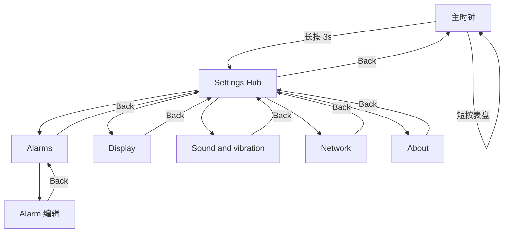

# Settings 统一配置中心 — 菜单与导航设计

**状态：** 已拍板（可实施）  
**最后更新：** 2026-06-03  
**关联：** [settings-and-display-idle.md](settings-and-display-idle.md)、[alarm-implementation.md](alarm-implementation.md)

---

## 1. 已拍板结论

| 项 | 决定 |
|----|------|
| 顶栏标题 | **Settings**（不用 Setup） |
| 进入方式 | 主时钟 **长按表盘 3 s** → Settings 主菜单（Hub） |
| 进入反馈 | **短振一次**（`chrone_haptic` / `vibration_trigger` 弱档） |
| 表盘切换 | **仅**主时钟 **短按** 表盘区；**不设** Clock face 菜单项 |
| 底栏虚拟键 | **时钟态**：左/中/右 **均无功能** |
| 配置树返回 | **长按 3 s**（任意位置）= 保存（若适用）并退回上一级；无底栏中键、无顶栏 Back |
| 菜单命名 | **Sound & vibration**（不用 Sound & Haptic） |
| **MVP 范围** | Hub + **Alarms** 改入口 + **Display** 子页 + **Sound & vibration** 子页 + 显示空闲（§2 [settings-and-display-idle.md](settings-and-display-idle.md)） |
| **设置类触觉** | 屏幕小、手指遮挡多 → **Settings 配置树内每次有效操作都有震动**（§4） |

---

## 2. 设计目标

| 目标 | 说明 |
|------|------|
| **一个入口** | 长按 3 s → **Settings Hub**，含闹钟与各设置子页 |
| **菜单清晰** | Hub 列表 → 子页；闹钟 **复用** 现有列表 + DSEG 编辑 |
| **手势简单** | 短按换表盘；长按进 Settings；子页 **Back** 逐级返回 |
| **触觉确认** | Settings 内 **点按、切换、拨动、返回** 均有震动（§4）；主时钟短按换表盘 **不振** |

**取代的旧方案：** ~~长按直进闹钟~~、~~底栏中键进设置~~、~~闹钟 Back 直回时钟~~。

---

## 3. 手势总表

### 3.1 主时钟屏

| 手势 | 区域 | 结果 |
|------|------|------|
| **短按** | 表盘主区（非底栏） | **数字 ↔ 模拟**，写 NVS `clk_mode` |
| **长按 3 s** | 表盘主区 | 进入 **Settings Hub** + **短振** |
| 底栏左 / 中 / 右 | — | **无功能**（不写入说明书） |
| 触摸 / 摇一摇 | 响铃中 | 停止响铃 |

**禁止：** 响铃中、配网全屏时启动长按计时。

### 3.2 Settings 配置树内（Hub、子页、闹钟列表/编辑）

| 操作 | 结果 | 震动 |
|------|------|------|
| **长按 3 s** | 上一级（§6 返回栈）；闹钟编辑会先保存 | ✓ confirm（§4） |
| 点选 Hub 行 / 子页控件 | 进入子页或改值 | ✓ 见 §4 |
| 任意触摸 | 刷新显示空闲计时，不关屏 | 仅上述操作振，不「摸屏就振」 |

---

## 4. Settings 触觉反馈（全局）

因 **320×240 屏小、无物理键**，Settings 相关操作统一用震动补足「点到了」的确认感。实现集中在 **`chrone_haptic`**（薄封装 `vibration`），UI 层不直接散落 `vibration_start`。

### 4.1 脉冲档位（建议）

| 类型 | API（建议） | 参数 | 用途 |
|------|-------------|------|------|
| **Confirm** | `chrone_haptic_confirm()` | ~100 ms，弱档 | 进入 Hub、点菜单行、Back、点选预设按钮、列切换 |
| **Detent** | `chrone_haptic_detent()` | ~20 ms，弱档 | 滑条跨档、滚轮每走一格；**节流 ≥50 ms** |
| **Success** | `chrone_haptic_success()`（可选） | 双脉冲 | 闹钟 Save 成功等（见 [alarm-setup-ui-design.md](alarm-setup-ui-design.md)） |

强度遵循 NVS `vibe_level`：**Settings UI 的 detent/confirm 用弱档**，与用户配置的「闹钟震动力度」可分离（UI 固定弱脉冲，避免在 Sound 页把 `vibe_level=Off` 时误伤反馈——见 §4.3）。

### 4.2 必须震动的事件（MVP）

| 场景 | 事件 | 脉冲 |
|------|------|------|
| **进入** | 主时钟长按 3 s 打开 Settings Hub | Confirm |
| **Hub** | 点一行（Alarms / Display / Sound & vibration） | Confirm |
| **Hub** | 顶栏 Back 回时钟 | Confirm |
| **Display** | 亮度滑条数值变化 | Detent（节流） |
| **Display** | 点选关屏时间 1/2/3/5/10 min | Confirm |
| **Sound & vibration** | 音量滑条数值变化 | Detent（节流） |
| **Sound & vibration** | 点选 Off/Weak/Med/Strong | Confirm + **按档位试振**（见下） |
| **Sound & vibration** | 点 `Preview` | Confirm（随后播放试听） |
| **Alarms** | 点列表某一条 | Confirm |
| **Alarms** | 顶栏 Back（列表→Hub，编辑→列表） | Confirm |
| **Alarms 编辑** | DSEG 滚轮每格 / 列切换 | 已有：Detent + Confirm（[alarm-setup-ui-design.md](alarm-setup-ui-design.md) §5.4） |

### 4.3 Sound 页「震动档位」与 UI 反馈的关系

| `vibe_level` | 点选档位时的 UI 反馈 |
|--------------|----------------------|
| **Off** | 仍发 **Confirm 弱脉冲**（菜单操作反馈）；**不**做长试振 |
| **Weak / Med / Strong** | Confirm + 按该档位 **试振一次**（让用户感受闹钟强度） |

即：**菜单操作的 confirm 振动** 与 **闹钟响铃强度** 解耦；`vibe_level=Off` 只关闹钟/试振，不关 Settings 导航反馈。

### 4.4 不震动（避免误振）

| 场景 | 原因 |
|------|------|
| 主时钟 **短按** 换数字/模拟 | 非 Settings，高频操作 |
| 手指在屏上滑动但未产生「值变化」 | 无 detent |
| 响铃中触摸停止闹钟 | 已有响铃策略，不叠加 Settings 规则 |
| 无效点击（禁用控件） | 无反馈 |

### 4.5 实现备注

- 进入 Hub 时：`chrone_ui_show_settings_hub()` 末尾调 `chrone_haptic_confirm()`。  
- Hub 列表 `LV_EVENT_CLICKED`：confirm。  
- 滑条 `LV_EVENT_VALUE_CHANGED`：仅当整档变化且距上次 ≥50 ms 时 detent。  
- 从子页 Back 回 Hub 后刷新摘要，**Back 本身已振**，无需再振。

---

## 5. 信息架构（菜单树）

```text
主时钟
    └── [长按 3s + 短振]
          Settings HUB
                ├── Alarms              → 闹钟列表（现有 UI）
                │       └── Alarm #n    → 编辑（现有 DSEG）
                ├── Display             → 亮度 + 关屏时间
                ├── Sound & vibration   → 闹钟音量 + 震动档位
                ├── Network             → WiFi 重配（P2）
                └── About               → 版本（P2）
```

**不在菜单中：** 数字/模拟表盘（`clk_mode`）— 仅主时钟 **短按** 切换。



---

## 6. 返回栈与屏幕 ID

| 屏幕 | `chrone_ui_screen_t`（建议） | Back 目标 |
|------|------------------------------|-----------|
| 主时钟 | `CLOCK` | — |
| Settings Hub | `SETTINGS_HUB` | `CLOCK` |
| Alarms 列表 | `ALARM_LIST` | `SETTINGS_HUB` |
| Alarm 编辑 | `ALARM_EDIT` | `ALARM_LIST` |
| Display | `SETTINGS_DISPLAY` | `SETTINGS_HUB` |
| Sound & vibration | `SETTINGS_SOUND` | `SETTINGS_HUB` |
| Network | `SETTINGS_NETWORK` | `SETTINGS_HUB`（P2） |
| About | `SETTINGS_ABOUT` | `SETTINGS_HUB`（P2） |

**实现要点：**

- 长按 → `chrone_ui_show_settings_hub()` + `chrone_haptic` 短振。  
- `chrone_ui_in_settings_tree()`：Hub、子页、闹钟配置均为 true。  
- 闹钟 Back → Hub；**仅 Hub Back** → `chrone_ui_show_clock()`。  
- `app_poll`：Settings 树内 **按住 ≥3 s** → `chrone_ui_nav_back()`（闹钟编辑走 `save_edit_and_back`）。

---

## 7. Settings Hub 主菜单（线框与行规范）

### 7.1 整体布局

| 区域 | 高度 | 内容 |
|------|------|------|
| 顶栏 | 36 px | `< Back`（左）+ 标题 **Settings**（居中） |
| 列表区 | 约 36–204 px | 可纵向滚动；MVP 3 行，P2 共 5 行 |
| 底栏 | 180–240 px | **无虚拟键功能**（与时钟态一致，留白） |

背景色与闹钟列表一致（如 `#06080C`）；行控件为全宽可点击按钮（同 `alarm_screen.cpp` 列表行）。

### 7.2 单行结构（统一模板）

每一行 **同一套排版**，从左到右三部分：

```text
[ 菜单名称 ]          [ 当前值摘要 ]   [ > ]
     ↑                      ↑           ↑
  左对齐              右对齐、摘要区    固定 chevron
  Montserrat 14/22    次要色、14      次要色
```

**视觉示意（单行长 304 px，左右各留约 8 px）：**

```
┌──────────────────────────────────────────────────────────┐
│  Alarms                              2 enabled        >  │
└──────────────────────────────────────────────────────────┘
```

| 元素 | 规范 |
|------|------|
| **菜单名称** | 英文左对齐；主文字色（白/浅灰） |
| **当前值摘要** | 紧靠 `>` 左侧；**次要色**（如 `#7A8499`）；无摘要时 **留空**（仅显示 `>`） |
| **`>`** | 固定在最右；表示可进入子页；不单独可点（整行可点） |
| 行高 | 40–44 px；行间距 6 px（与闹钟列表一致） |
| 分隔 | 可选 1 px 暗分隔线；或仅用行间距 |

**不要用**「名称 — 摘要」中间的 em dash 画在 UI 上；摘要为 **独立右对齐字段**，阅读效果等价于你描述的 `Alarms — 2 enabled`。

### 7.3 完整线框（MVP + P2）

```
┌──────────────────────────── 320 ────────────────────────────┐
│  [< Back]              Settings                    y:0–36   │
├─────────────────────────────────────────────────────────────┤
│  ┌─────────────────────────────────────────────────────┐    │
│  │  Alarms                              2 enabled    >   │    │
│  └─────────────────────────────────────────────────────┘    │
│  ┌─────────────────────────────────────────────────────┐    │
│  │  Display                             60% · 2m     >   │    │
│  └─────────────────────────────────────────────────────┘    │
│  ┌─────────────────────────────────────────────────────┐    │
│  │  Sound & vibration                   68% · Med    >   │    │
│  └─────────────────────────────────────────────────────┘    │
│  ┌─────────────────────────────────────────────────────┐    │  P2
│  │  Network                                          >   │    │
│  └─────────────────────────────────────────────────────┘    │
│  ┌─────────────────────────────────────────────────────┐    │  P2
│  │  About                                            >   │    │
│  └─────────────────────────────────────────────────────┘    │
└─────────────────────────────────────────────────────────────┘
```

### 7.4 各行摘要文案规则

进入 Hub 时从 NVS / 运行时状态 **刷新一次**；从子页 Back 回 Hub 时 **再刷新**（子页改动的值要立刻体现在摘要上）。

| 菜单名称（左） | 摘要（右，无则空） | 生成规则 | MVP |
|----------------|-------------------|----------|-----|
| **Alarms** | `2 enabled` | `enabled` 为 true 的条数 N；N=0 显示 `None`；N=1 显示 `1 enabled` | ✓ |
| **Display** | `60% · 2m` | `{brightness}% · {blank_timeout_s/60}m`，分钟取整；如 `30% · 5m` | ✓ |
| **Sound & vibration** | `68% · Med` | `{alarm_vol}% · {档位名}`；档位 0→`Off`，1→`Weak`，2→`Med`，3→`Strong` | ✓ |
| **Network** | （空）或 `MyWiFi` | P2：已连接且已知 SSID 时显示 SSID（过长截断）；否则 **仅 `>`** | P2 |
| **About** | （空） | **仅 `>`**，无摘要 | P2 |

**示例对照（与你给的文案一致）：**

| 行 | 用户可读 |
|----|----------|
| Alarms | Alarms — **2 enabled** |
| Display | Display — **60% · 2m** |
| Sound & vibration | Sound & vibration — **68% · Med** |
| Network | Network（**无摘要**，只有 `>`） |
| About | About（**无摘要**，只有 `>`） |

**Display 摘要格式：** 亮度与关屏时间之间用 **空格 + 中点 + 空格**（` · `）连接，不用逗号，便于扫读。

**Sound & vibration 摘要格式：** 音量百分比 + ` · ` + 档位英文名；`Off` 时仍显示百分比，如 `0% · Off`。

### 7.5 交互

| 操作 | 行为 | 震动 |
|------|------|------|
| 点整行 | 进入对应子页 | Confirm |
| 顶栏 Back | 回主时钟 | Confirm |
| 列表超出可视区 | 纵向滚动 | 无（仅点击行时振） |

### 7.6 与子页关系

| 菜单行 | 子页 |
|--------|------|
| Alarms | 闹钟列表（现有 UI） |
| Display | 亮度 + 关屏预设 |
| Sound & vibration | 音量滑条 + 震动四档 |
| Network | WiFi 重配（P2） |
| About | 版本只读（P2） |

---

## 8. 子页面说明

> 子页内控件操作震动见 **§4.2**。

### 8.1 Alarms

复用 [alarm-implementation.md](alarm-implementation.md) / `alarm_screen.cpp`；**入口** Hub → Alarms；**Back** 列表 → Hub。

### 8.2 Display

| 控件 | NVS | 默认 |
|------|-----|------|
| Brightness 滑条 | `brightness` | 60 |
| Turn off after 1/2/3/5/10 min | `blank_timeout_s` | 120 |

### 8.3 Sound & vibration

| 控件 | NVS |
|------|-----|
| Alarm volume + `Preview` | `alarm_vol` |
| Off / Weak / Med / Strong | `vibe_level`（选中试振） |

### 8.4 Network / About（P2）

同前草案。

### 8.5 表盘模式（不在 Settings）

| 操作 | 说明 |
|------|------|
| 主时钟 **短按** 表盘 | 切换 Digital/Analog，写 `clk_mode` |
| Settings 菜单 | **无** Clock face 项 |

---

## 9. 配置项 ↔ 菜单映射

| 设置 | 路径 | NVS | MVP |
|------|------|-----|-----|
| 闹钟 | Settings → Alarms | `alarm_cfg` | ✓ |
| 亮度 / 关屏 | Settings → Display | `brightness`, `blank_timeout_s` | ✓ |
| 音量 / 震动 | Settings → Sound & vibration | `alarm_vol`, `vibe_level` | ✓ |
| 表盘 | **仅短按主时钟** | `clk_mode` | （已有） |
| WiFi | Settings → Network | `wifi` | P2 |

---

## 10. 用户操作速查

| 我想… | 操作 |
|--------|------|
| 打开设置 | 主时钟 **长按表盘 3s**（感到短振即进入） |
| 改闹钟 | 长按 3s → **Alarms** |
| 亮度 / 关屏时间 | 长按 3s → **Display** |
| 音量 / 震动 | 长按 3s → **Sound & vibration** |
| 换表盘 | 主时钟 **短按** 表盘（不进 Settings） |
| 退出设置 | Hub 点 **Back** 回时钟；子页先 Back 回 Hub |

---

## 11. 实现阶段（已拍板 MVP）

| 阶段 | 内容 |
|------|------|
| **MVP** | Hub + 子页 + Alarms；**§4 全套触觉**；显示空闲；顶栏 Back |
| **P2** | Network、About |

---

## 12. 代码改动清单

| 模块 | 改动 |
|------|------|
| `digital_clock.cpp` | 长按 → `chrone_ui_show_settings_hub()` + `chrone_haptic_confirm()` |
| `chrone_haptic.c` | 实现 `confirm` / `detent`（及可选 `success`）；Settings 导航用固定弱档 |
| `settings_hub_screen.cpp` 等 | 行点击、Back、滑条、预设按钮处挂 §4.2 |
| `alarm_screen.cpp` | Back → Hub；列表点击 confirm；编辑区沿用 alarm-setup §5.4 |
| `app_poll.cpp` | 移除中键返回 |
| `chrone_ui.h` | `chrone_ui_in_settings_tree()` |

---

## 13. 修订记录

| 日期 | 说明 |
|------|------|
| 2026-06-03 | 初版：长按 3s Hub |
| 2026-06-03 | 拍板：Settings；Hub 行规范；MVP |
| 2026-06-03 | §4：Settings 配置树内操作统一触觉反馈 |
